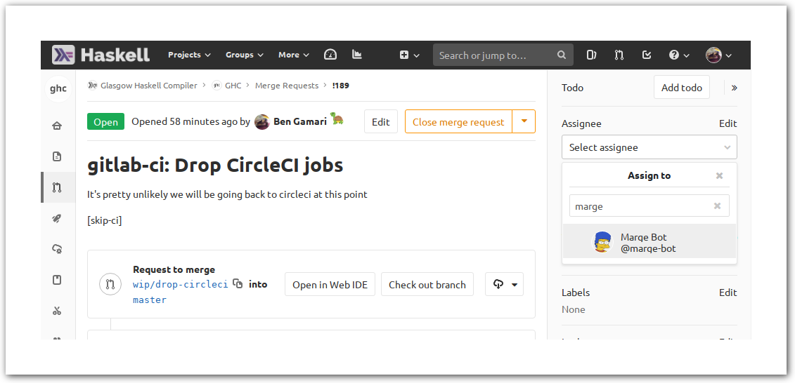
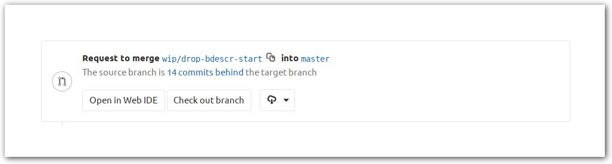
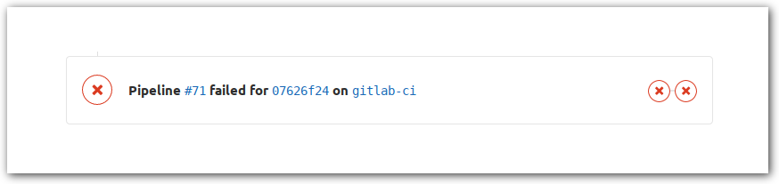
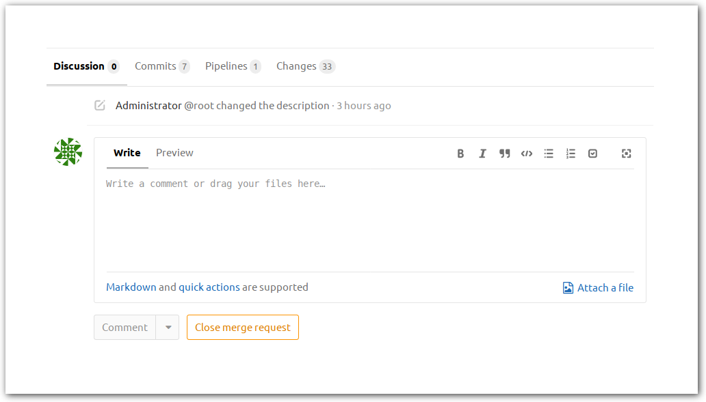

<!--
To generate images with borders:
```
mkdir -p shadow
rm shadow/*
for i in *.png; do 
        nix run nixpkgs.imagemagick -c \
                convert $i -bordercolor white -border 50 \
                \( +clone -background black -shadow 80x5+2+2 \) \
                +swap -background white -layers merge +repage \
                shadow/$i
done
```
-->

# THIS PAGE IS A DRAFT

Submitting a patch for incorporation into the tree is done by creating a *merge request*. The merge request serves as a place to conduct code review, collect continuous integration results, and eventually merge your patch.

## Merge Request Workflow

TODO: This workflow is not fully finalized

1. If you're fixing a bug then have a look at [fixing bugs](working-conventions/fixing-bugs) else if you're adding a feature see [adding features](/working-conventions/adding-features).
1. **Open an MR** (see [below](#opening-a-merge-request)).
  * ~"MR::1-needs triage" label is set automatically.
1. **Triage** can be performed by any developer including yourself (see [MR triage protocol](/gitlab/merge-requests#triage-protocol)). This should be done within 1 day.
  * ~”MR::2-under review” label is set by the developer that performed the triage.
1. **Technical review** reviewers will evaluate the concept and implementation of the patch and work with the contributor (that's you) to iterate as necessary. Reviewers can use the “Approve” button to indicate they are happy with the MR.
  * ~”MR::3-ready for merge” label is set by the contributor (that's you) once reviewers and contributor are satisfied with the MR.
1. **Final Review** a maintainer will have a final look at the MR (TODO link needed) and add the MR to the merge queue (currently by [assigning to @marge-bot](#merging-your-merge-request).
  * ~”MR::4-in merge queue” label is set by the maintainer.
1. **Post-merge cleanup** the contributor (that's you) should close and/or have a final look over the any related issues.

## Merging your merge request

Currently we merge MRs with the aid of @marge-bot. A maintainer can flag your MR for merge by assigning it to @marge-bot using the "Assignee" field in the right sidebar:



As long as your MR satisfies the following, marge will batch your MR with other MRs and attempt to merge into master:

* Assigned to Marge
* Approved by a GHC developer
* Passing CI
* Has no merge conflicts with master (see rebasing below)

Each batch is an MR and must pass CI, so you can expect Marge to merge 2 or 3 batches per day. She will usually comment on your MR to inform you of progress, but you can also view the status of Marge's batches/MRs [on GitLab](https://gitlab.haskell.org/ghc/ghc/merge_requests?scope=all&utf8=%E2%9C%93&state=all&author_username=marge-bot).

### Rebasing

You generally do NOT need to rebase your MRs unless there are merge conflicts with master. Marge will automatically rebase ontop of master when batching MRs.

Note GitLab usually complains that "Fast-forward merge is not possible" on your MR. If you see a green check and green "Rebase" button then there are no merge conflicts and NO action is necessary. If instead you see an exclamation mark and disabled "Merge" button, you must rebase manually and fix any merge conflicts.

## Opening a merge request

To open a merge request:

1. Push your branch. You may push either to your fork or the primary `ghc/ghc` project.
2. Starting from the [GHC GitLab project](https://gitlab.haskell.org/ghc/ghc) click on the *Merge Requests* link in the left navigational bar.
3. Click on the green *New Merge Request* button on the top right corner of the Merge Requests page
4. In the left drop-down of the *Source branch* pane select the project to which you pushed your branch.
5. In the right drop-down of the *Source branch* pane select the name of your branch.
6. Click on the green *Compare branches and continue* button.
7. Give your merge request a title. Suffix with the issue number e.g "Fix some bug #12345"
8. Write a description of your change. This should be ideally at very least a few sentences to help reviewers understand what you have done.
9. Click on the green *Submit merge request* button.

## Working with your merge request

Your merge request shows you several panes information:

Top-most is the request's title and description. These can be edited by pressing the yellow `Edit` button on the top-right corner of the page.

The next pane summarises your merge request, showing the the source and target branches.



The next pane shows the status of the merge request's continuous integration builds. If the build has failed you can click on the red *X* icon to see the build log.



At the bottom of the page is the code review interface, consisting of several tabs:



The *Discussion* tab shows a summary of the comments left on the change. This includes comments left in-line in the code, as well as those independent of the code. 

The *Commits* tab lists the commits being proposed for merge. These may be clicked upon to restrict the diff to only changes made by that commit. 

The *Pipelines* tab provides a more detailed overview on the state of the various continuous integration jobs associated with the merge request.

Finally, the *Changes* tab shows the patch itself. This view may be restricted to changes made by a single commit by selecting the commit in the *Commits* tab. Moreover, one may view previous iterations of the merge request using the two drop-down menus at the top of the tab. To leave an inline comment click on a line in the patch.