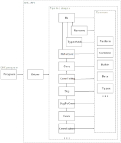

Motivation
==========

This is an ongoing effort to make GHC more modular.

* Make the pipeline more reusable.
    * For historical reasons, the current codebase assumes a straight pipeline from Haskell files to Cmm.
    * Clash and IHC forks after Core, GHCJS forks after Stg, Asterius forks after Cmm, etc. We could imagine other languages targeting Core, Stg or Cmm. They often can't use GHC-API from a stock GHC and rely on a forked GHC instead.
    * I would like to have an interactive frontend that can explore different optimizations order, etc. Currently GHC-API doesn't make it simple/possible to do.
    * A Unison-like frontend for GHC would be very cool but it would break many assumptions about file organization, packages, etc.

* Test independent parts of the compiler with "modern" tools (QuickCheck, etc.).
    * Compare IR expressions instead of IR dumps: faster, avoid fragile output canonicalization
    * Make the testsuite faster: don't execute the whole pipeline
    * Catch more bugs/regressions maybe
    * Provide Criterion reports (checked in CI?)

* Make GHC multi-sessions, multi-targets, multi-threaded...
    * It will be easier with constrained side-effects and a more modular code-base

Principles
==========

1. Make the different stages of the pipeline usable independently from each other
2. Avoid shared mutable state and uncontrolled side-effects
3. Clearly separate GHC-the-program from GHC-API

Tasks
=====

Make the pipeline apparent in the module hierarchy (#13009)
-----------------------------------------------------------

We would like to introduce the following module prefixes:



The boxes are the GHC.XXX top-level module prefixes. For example, the box `Hs` stands for a module `GHC.Hs` and a collection of sub-module (e.g. `GHC.Hs.Pat`, `GHC.Hs.Expr` etc)

The arrows indicate allowed dependencies between groups of modules.

Principles:
* Consider top-level modules GHC.XXX as if they were from independent packages
* Put together modules defining, transforming and analyzing each IR: GHC.{Hs,Core,Stg,Cmm,Iface,Llvm,etc.}
* Put each IR-to-IR compiler under top-level "GHC.Ir1ToIr2" (e.g. GHC.StgToCmm)

Goals:
* Group all the GHC modules under the GHC prefix (common convention for Haskell packages, least surprise)
* Ensure that each IR can be used independently from the others
* Improve the generated Haddocks (table of contents reflecting the hierarchy)

Proposed hierarchy:
```
-- IRs
GHC.Hs
GHC.Core
GHC.Stg
GHC.Cmm
GHC.Iface
GHC.Bytecode
GHC.Llvm

-- Compilers, fron one IR to another
GHC.Rename      -- Note that both the renamer and the typechecker work on the Hs representation
GHC.Typecheck   -- but with a different type index (GhcPs, GhcRn, GhcTc)
GHC.HsToCore
GHC.CoreToStg
GHC.StgToCmm
GHC.CmmToAsm
GHC.CmmToC
GHC.CmmToLlvm
GHC.CoreToIface
GHC.CoreToBytecode

GHC.Driver: pipeline driver (Backpack, Finder, Main, Make, MakeDepend, etc.)
GHC.Program: command-line parsing, GHCi UI, etc.

-- shared stuff
GHC.Builtins: primops, etc.
GHC.Data: data structures (Bag, Graph, FiniteMap, EnumSet, etc.)
GHC.Common (Id, Name, etc.)
GHC.{Runtime/Interactive}: interactive evaluation stuff (Debugger, Eval, etc.)
GHC.Plugin
GHC.Utils: SysTools, IO stuff, Outputable, etc.
GHC.Platform: platform description (register mapping, word-size, etc.)
GHC.Config: Constants, DynFlags, etc.
```

* Done (can still be modified):

```
GHC.Hs.Binds <= GHC/Hs/Binds.hs
GHC.Hs.Decls <= GHC/Hs/Decls.hs
GHC.Hs.Doc   <= GHC/Hs/Doc.hs
GHC.Hs.Dump  <= GHC/Hs/Dump.hs
GHC.Hs.Expr  <= GHC/Hs/Expr.hs
GHC.Hs.Extension <= GHC/Hs/Extension.hs
GHC.Hs <= GHC/Hs.hs
GHC.Hs.ImpExp <= GHC/Hs/ImpExp.hs
GHC.Hs.Instances <= GHC/Hs/Instances.hs
GHC.Hs.Lit <= GHC/Hs/Lit.hs
GHC.Hs.Pat <= GHC/Hs/Pat.hs
GHC.Hs.PlaceHolder <= GHC/Hs/PlaceHolder.hs
GHC.HsToCore.PmCheck <= GHC/HsToCore/PmCheck.hs
GHC.HsToCore.PmCheck.Oracle <= GHC/HsToCore/PmCheck/Oracle.hs
GHC.HsToCore.PmCheck.Ppr <= GHC/HsToCore/PmCheck/Ppr.hs
GHC.HsToCore.PmCheck.Types <= GHC/HsToCore/PmCheck/Types.hs
GHC.Hs.Types <= GHC/Hs/Types.hs
GHC.Hs.Utils <= GHC/Hs/Utils.hs
```

* Renamer !1899:


```
GHC.Rename.Binds <= rename/RnBinds.hs
GHC.Rename.Env <= rename/RnEnv.hs
GHC.Rename.Expr <= rename/RnExpr.hs
GHC.Rename.Fixity <= rename/RnFixity.hs
GHC.Rename.Doc <= rename/RnHsDoc.hs
GHC.Rename.Names <= rename/RnNames.hs
GHC.Rename.Pat <= rename/RnPat.hs
GHC.Rename.Source <= rename/RnSource.hs
GHC.Rename.Splice <= rename/RnSplice.hs
GHC.Rename.Types <= rename/RnTypes.hs
GHC.Rename.Unbound <= rename/RnUnbound.hs
GHC.Rename.Utils <= rename/RnUtils.hs
```

* TODO:

```
? <= backpack/BkpSyn.hs
? <= backpack/DriverBkp.hs
? <= backpack/NameShape.hs
? <= backpack/RnModIface.hs
? <= basicTypes/Avail.hs
? <= basicTypes/BasicTypes.hs
? <= basicTypes/ConLike.hs
? <= basicTypes/DataCon.hs
? <= basicTypes/Demand.hs
? <= basicTypes/FieldLabel.hs
? <= basicTypes/Id.hs
? <= basicTypes/IdInfo.hs
? <= basicTypes/Lexeme.hs
? <= basicTypes/Literal.hs
? <= basicTypes/MkId.hs
? <= basicTypes/Module.hs
? <= basicTypes/NameCache.hs
? <= basicTypes/NameEnv.hs
? <= basicTypes/Name.hs
? <= basicTypes/NameSet.hs
? <= basicTypes/OccName.hs
? <= basicTypes/PatSyn.hs
? <= basicTypes/RdrName.hs
? <= basicTypes/SrcLoc.hs
? <= basicTypes/UniqSupply.hs
? <= basicTypes/Unique.hs
? <= basicTypes/VarEnv.hs
? <= basicTypes/Var.hs
? <= basicTypes/VarSet.hs
? <= cmm/Bitmap.hs
? <= cmm/BlockId.hs
? <= cmm/CLabel.hs
? <= cmm/CmmBuildInfoTables.hs
? <= cmm/CmmCallConv.hs
? <= cmm/CmmCommonBlockElim.hs
? <= cmm/CmmContFlowOpt.hs
? <= cmm/CmmExpr.hs
? <= cmm/Cmm.hs
? <= cmm/CmmImplementSwitchPlans.hs
? <= cmm/CmmInfo.hs
? <= cmm/CmmLayoutStack.hs
? <= cmm/CmmLint.hs
? <= cmm/CmmLive.hs
? <= cmm/CmmMachOp.hs
? <= cmm/CmmMonad.hs
? <= cmm/CmmNode.hs
? <= cmm/CmmOpt.hs
? <= cmm/CmmPipeline.hs
? <= cmm/CmmProcPoint.hs
? <= cmm/CmmSink.hs
? <= cmm/CmmSwitch.hs
? <= cmm/CmmType.hs
? <= cmm/CmmUtils.hs
? <= cmm/Debug.hs
? <= cmm/Hoopl/Block.hs
? <= cmm/Hoopl/Collections.hs
? <= cmm/Hoopl/Dataflow.hs
? <= cmm/Hoopl/Graph.hs
? <= cmm/Hoopl/Label.hs
? <= cmm/MkGraph.hs
? <= cmm/PprC.hs
? <= cmm/PprCmmDecl.hs
? <= cmm/PprCmmExpr.hs
? <= cmm/PprCmm.hs
? <= cmm/SMRep.hs
? <= coreSyn/CoreArity.hs
? <= coreSyn/CoreFVs.hs
? <= coreSyn/CoreLint.hs
? <= coreSyn/CoreMap.hs
? <= coreSyn/CoreOpt.hs
? <= coreSyn/CorePrep.hs
? <= coreSyn/CoreSeq.hs
? <= coreSyn/CoreStats.hs
? <= coreSyn/CoreSubst.hs
? <= coreSyn/CoreSyn.hs
? <= coreSyn/CoreTidy.hs
? <= coreSyn/CoreUnfold.hs
? <= coreSyn/CoreUtils.hs
? <= coreSyn/MkCore.hs
? <= coreSyn/PprCore.hs
? <= deSugar/Coverage.hs
? <= deSugar/Desugar.hs
? <= deSugar/DsArrows.hs
? <= deSugar/DsBinds.hs
? <= deSugar/DsCCall.hs
? <= deSugar/DsExpr.hs
? <= deSugar/DsForeign.hs
? <= deSugar/DsGRHSs.hs
? <= deSugar/DsListComp.hs
? <= deSugar/DsMeta.hs
? <= deSugar/DsMonad.hs
? <= deSugar/DsUsage.hs
? <= deSugar/DsUtils.hs
? <= deSugar/ExtractDocs.hs
? <= deSugar/MatchCon.hs
? <= deSugar/Match.hs
? <= deSugar/MatchLit.hs
? <= ghci/ByteCodeAsm.hs
? <= ghci/ByteCodeGen.hs
? <= ghci/ByteCodeInstr.hs
? <= ghci/ByteCodeItbls.hs
? <= ghci/ByteCodeLink.hs
? <= ghci/ByteCodeTypes.hs
? <= ghci/Debugger.hs
? <= ghci/GHCi.hs
? <= ghci/Linker.hs
? <= ghci/LinkerTypes.hs
? <= ghci/RtClosureInspect.hs
? <= GHC/Platform/ARM64.hs
? <= GHC/Platform/ARM.hs
? <= GHC/Platform/NoRegs.hs
? <= GHC/Platform/PPC.hs
? <= GHC/Platform/Regs.hs
? <= GHC/Platform/SPARC.hs
? <= GHC/Platform/X86_64.hs
? <= GHC/Platform/X86.hs
? <= GHC/StgToCmm/ArgRep.hs
? <= GHC/StgToCmm/Bind.hs
? <= GHC/StgToCmm/CgUtils.hs
? <= GHC/StgToCmm/Closure.hs
? <= GHC/StgToCmm/DataCon.hs
? <= GHC/StgToCmm/Env.hs
? <= GHC/StgToCmm/Expr.hs
? <= GHC/StgToCmm/ExtCode.hs
? <= GHC/StgToCmm/Foreign.hs
? <= GHC/StgToCmm/Heap.hs
? <= GHC/StgToCmm/Hpc.hs
? <= GHC/StgToCmm.hs
? <= GHC/StgToCmm/Layout.hs
? <= GHC/StgToCmm/Monad.hs
? <= GHC/StgToCmm/Prim.hs
? <= GHC/StgToCmm/Prof.hs
? <= GHC/StgToCmm/Ticky.hs
? <= GHC/StgToCmm/Utils.hs
? <= GHC/ThToHs.hs
? <= hieFile/HieAst.hs
? <= hieFile/HieBin.hs
? <= hieFile/HieDebug.hs
? <= hieFile/HieTypes.hs
? <= hieFile/HieUtils.hs
? <= iface/BinFingerprint.hs
? <= iface/BinIface.hs
? <= iface/BuildTyCl.hs
? <= iface/FlagChecker.hs
? <= iface/IfaceEnv.hs
? <= iface/IfaceSyn.hs
? <= iface/IfaceType.hs
? <= iface/LoadIface.hs
? <= iface/MkIface.hs
? <= iface/TcIface.hs
? <= iface/ToIface.hs
? <= llvmGen/Llvm/AbsSyn.hs
? <= llvmGen/LlvmCodeGen/Base.hs
? <= llvmGen/LlvmCodeGen/CodeGen.hs
? <= llvmGen/LlvmCodeGen/Data.hs
? <= llvmGen/LlvmCodeGen.hs
? <= llvmGen/LlvmCodeGen/Ppr.hs
? <= llvmGen/LlvmCodeGen/Regs.hs
? <= llvmGen/Llvm.hs
? <= llvmGen/LlvmMangler.hs
? <= llvmGen/Llvm/MetaData.hs
? <= llvmGen/Llvm/PpLlvm.hs
? <= llvmGen/Llvm/Types.hs
? <= main/Annotations.hs
? <= main/Ar.hs
? <= main/CliOption.hs
? <= main/CmdLineParser.hs
? <= main/CodeOutput.hs
? <= main/Constants.hs
? <= main/DriverMkDepend.hs
? <= main/DriverPhases.hs
? <= main/DriverPipeline.hs
? <= main/DynamicLoading.hs
? <= main/DynFlags.hs
? <= main/Elf.hs
? <= main/ErrUtils.hs
? <= main/FileCleanup.hs
? <= main/FileSettings.hs
? <= main/Finder.hs
? <= main/GHC.hs
? <= main/GhcMake.hs
? <= main/GhcMonad.hs
? <= main/GhcNameVersion.hs
? <= main/GhcPlugins.hs
? <= main/HeaderInfo.hs
? <= main/Hooks.hs
? <= main/HscMain.hs
? <= main/HscStats.hs
? <= main/HscTypes.hs
? <= main/InteractiveEval.hs
? <= main/InteractiveEvalTypes.hs
? <= main/PackageConfig.hs
? <= main/Packages.hs
? <= main/PipelineMonad.hs
? <= main/PlatformConstants.hs
? <= main/Plugins.hs
? <= main/PprTyThing.hs
? <= main/Settings.hs
? <= main/StaticPtrTable.hs
? <= main/SysTools/BaseDir.hs
? <= main/SysTools/ExtraObj.hs
? <= main/SysTools.hs
? <= main/SysTools/Info.hs
? <= main/SysTools/Process.hs
? <= main/SysTools/Settings.hs
? <= main/SysTools/Tasks.hs
? <= main/SysTools/Terminal.hs
? <= main/TidyPgm.hs
? <= main/ToolSettings.hs
? <= nativeGen/AsmCodeGen.hs
? <= nativeGen/BlockLayout.hs
? <= nativeGen/CFG.hs
? <= nativeGen/CPrim.hs
? <= nativeGen/Dwarf/Constants.hs
? <= nativeGen/Dwarf.hs
? <= nativeGen/Dwarf/Types.hs
? <= nativeGen/Format.hs
? <= nativeGen/Instruction.hs
? <= nativeGen/NCGMonad.hs
? <= nativeGen/PIC.hs
? <= nativeGen/PPC/CodeGen.hs
? <= nativeGen/PPC/Cond.hs
? <= nativeGen/PPC/Instr.hs
? <= nativeGen/PPC/Ppr.hs
? <= nativeGen/PPC/RegInfo.hs
? <= nativeGen/PPC/Regs.hs
? <= nativeGen/PprBase.hs
? <= nativeGen/RegAlloc/Graph/ArchBase.hs
? <= nativeGen/RegAlloc/Graph/ArchX86.hs
? <= nativeGen/RegAlloc/Graph/Coalesce.hs
? <= nativeGen/RegAlloc/Graph/Main.hs
? <= nativeGen/RegAlloc/Graph/SpillClean.hs
? <= nativeGen/RegAlloc/Graph/SpillCost.hs
? <= nativeGen/RegAlloc/Graph/Spill.hs
? <= nativeGen/RegAlloc/Graph/Stats.hs
? <= nativeGen/RegAlloc/Graph/TrivColorable.hs
? <= nativeGen/RegAlloc/Linear/Base.hs
? <= nativeGen/RegAlloc/Linear/FreeRegs.hs
? <= nativeGen/RegAlloc/Linear/JoinToTargets.hs
? <= nativeGen/RegAlloc/Linear/Main.hs
? <= nativeGen/RegAlloc/Linear/PPC/FreeRegs.hs
? <= nativeGen/RegAlloc/Linear/SPARC/FreeRegs.hs
? <= nativeGen/RegAlloc/Linear/StackMap.hs
? <= nativeGen/RegAlloc/Linear/State.hs
? <= nativeGen/RegAlloc/Linear/Stats.hs
? <= nativeGen/RegAlloc/Linear/X86_64/FreeRegs.hs
? <= nativeGen/RegAlloc/Linear/X86/FreeRegs.hs
? <= nativeGen/RegAlloc/Liveness.hs
? <= nativeGen/RegClass.hs
? <= nativeGen/Reg.hs
? <= nativeGen/SPARC/AddrMode.hs
? <= nativeGen/SPARC/Base.hs
? <= nativeGen/SPARC/CodeGen/Amode.hs
? <= nativeGen/SPARC/CodeGen/Base.hs
? <= nativeGen/SPARC/CodeGen/CondCode.hs
? <= nativeGen/SPARC/CodeGen/Expand.hs
? <= nativeGen/SPARC/CodeGen/Gen32.hs
? <= nativeGen/SPARC/CodeGen/Gen64.hs
? <= nativeGen/SPARC/CodeGen.hs
? <= nativeGen/SPARC/CodeGen/Sanity.hs
? <= nativeGen/SPARC/Cond.hs
? <= nativeGen/SPARC/Imm.hs
? <= nativeGen/SPARC/Instr.hs
? <= nativeGen/SPARC/Ppr.hs
? <= nativeGen/SPARC/Regs.hs
? <= nativeGen/SPARC/ShortcutJump.hs
? <= nativeGen/SPARC/Stack.hs
? <= nativeGen/TargetReg.hs
? <= nativeGen/X86/CodeGen.hs
? <= nativeGen/X86/Cond.hs
? <= nativeGen/X86/Instr.hs
? <= nativeGen/X86/Ppr.hs
? <= nativeGen/X86/RegInfo.hs
? <= nativeGen/X86/Regs.hs
? <= parser/ApiAnnotation.hs
? <= parser/Ctype.hs
? <= parser/HaddockUtils.hs
? <= parser/RdrHsSyn.hs
? <= prelude/ForeignCall.hs
? <= prelude/KnownUniques.hs
? <= prelude/PrelInfo.hs
? <= prelude/PrelNames.hs
? <= prelude/PrelRules.hs
? <= prelude/PrimOp.hs
? <= prelude/THNames.hs
? <= prelude/TysPrim.hs
? <= prelude/TysWiredIn.hs
? <= profiling/CostCentre.hs
? <= profiling/CostCentreState.hs
? <= profiling/ProfInit.hs
? <= simplCore/CallArity.hs
? <= simplCore/CoreMonad.hs
? <= simplCore/CSE.hs
? <= simplCore/Exitify.hs
? <= simplCore/FloatIn.hs
? <= simplCore/FloatOut.hs
? <= simplCore/LiberateCase.hs
? <= simplCore/OccurAnal.hs
? <= simplCore/SAT.hs
? <= simplCore/SetLevels.hs
? <= simplCore/SimplCore.hs
? <= simplCore/SimplEnv.hs
? <= simplCore/Simplify.hs
? <= simplCore/SimplMonad.hs
? <= simplCore/SimplUtils.hs
? <= simplStg/RepType.hs
? <= simplStg/SimplStg.hs
? <= simplStg/StgCse.hs
? <= simplStg/StgLiftLams/Analysis.hs
? <= simplStg/StgLiftLams.hs
? <= simplStg/StgLiftLams/LiftM.hs
? <= simplStg/StgLiftLams/Transformation.hs
? <= simplStg/StgStats.hs
? <= simplStg/UnariseStg.hs
? <= specialise/Rules.hs
? <= specialise/SpecConstr.hs
? <= specialise/Specialise.hs
? <= stgSyn/CoreToStg.hs
? <= stgSyn/StgFVs.hs
? <= stgSyn/StgLint.hs
? <= stgSyn/StgSubst.hs
? <= stgSyn/StgSyn.hs
? <= stranal/DmdAnal.hs
? <= stranal/WorkWrap.hs
? <= stranal/WwLib.hs
? <= typecheck/ClsInst.hs
? <= typecheck/FamInst.hs
? <= typecheck/FunDeps.hs
? <= typecheck/Inst.hs
? <= typecheck/TcAnnotations.hs
? <= typecheck/TcArrows.hs
? <= typecheck/TcBackpack.hs
? <= typecheck/TcBinds.hs
? <= typecheck/TcCanonical.hs
? <= typecheck/TcClassDcl.hs
? <= typecheck/TcDefaults.hs
? <= typecheck/TcDeriv.hs
? <= typecheck/TcDerivInfer.hs
? <= typecheck/TcDerivUtils.hs
? <= typecheck/TcEnv.hs
? <= typecheck/TcErrors.hs
? <= typecheck/TcEvidence.hs
? <= typecheck/TcEvTerm.hs
? <= typecheck/TcExpr.hs
? <= typecheck/TcFlatten.hs
? <= typecheck/TcForeign.hs
? <= typecheck/TcGenDeriv.hs
? <= typecheck/TcGenFunctor.hs
? <= typecheck/TcGenGenerics.hs
? <= typecheck/TcHoleErrors.hs
? <= typecheck/TcHoleFitTypes.hs
? <= typecheck/TcHsSyn.hs
? <= typecheck/TcHsType.hs
? <= typecheck/TcInstDcls.hs
? <= typecheck/TcInteract.hs
? <= typecheck/TcMatches.hs
? <= typecheck/TcMType.hs
? <= typecheck/TcPat.hs
? <= typecheck/TcPatSyn.hs
? <= typecheck/TcPluginM.hs
? <= typecheck/TcRnDriver.hs
? <= typecheck/TcRnExports.hs
? <= typecheck/TcRnMonad.hs
? <= typecheck/TcRnTypes.hs
? <= typecheck/TcRules.hs
? <= typecheck/TcSigs.hs
? <= typecheck/TcSimplify.hs
? <= typecheck/TcSMonad.hs
? <= typecheck/TcSplice.hs
? <= typecheck/TcTyClsDecls.hs
? <= typecheck/TcTyDecls.hs
? <= typecheck/TcTypeable.hs
? <= typecheck/TcType.hs
? <= typecheck/TcTypeNats.hs
? <= typecheck/TcUnify.hs
? <= typecheck/TcValidity.hs
? <= types/Class.hs
? <= types/CoAxiom.hs
? <= types/Coercion.hs
? <= types/FamInstEnv.hs
? <= types/InstEnv.hs
? <= types/Kind.hs
? <= types/OptCoercion.hs
? <= types/TyCoFVs.hs
? <= types/TyCon.hs
? <= types/TyCoPpr.hs
? <= types/TyCoRep.hs
? <= types/TyCoSubst.hs
? <= types/TyCoTidy.hs
? <= types/Type.hs
? <= types/Unify.hs
? <= utils/AsmUtils.hs
? <= utils/Bag.hs
? <= utils/Binary.hs
? <= utils/BooleanFormula.hs
? <= utils/BufWrite.hs
? <= utils/Digraph.hs
? <= utils/Encoding.hs
? <= utils/EnumSet.hs
? <= utils/Exception.hs
? <= utils/FastFunctions.hs
? <= utils/FastMutInt.hs
? <= utils/FastStringEnv.hs
? <= utils/FastString.hs
? <= utils/Fingerprint.hs
? <= utils/FiniteMap.hs
? <= utils/FV.hs
? <= utils/GhcPrelude.hs
? <= utils/GraphBase.hs
? <= utils/GraphColor.hs
? <= utils/GraphOps.hs
? <= utils/GraphPpr.hs
? <= utils/IOEnv.hs
? <= utils/Json.hs
? <= utils/ListSetOps.hs
? <= utils/Maybes.hs
? <= utils/MonadUtils.hs
? <= utils/OrdList.hs
? <= utils/Outputable.hs
? <= utils/Pair.hs
? <= utils/Panic.hs
? <= utils/PlainPanic.hs
? <= utils/PprColour.hs
? <= utils/Pretty.hs
? <= utils/State.hs
? <= utils/Stream.hs
? <= utils/StringBuffer.hs
? <= utils/TrieMap.hs
? <= utils/UniqDFM.hs
? <= utils/UniqDSet.hs
? <= utils/UniqFM.hs
? <= utils/UniqMap.hs
? <= utils/UniqSet.hs
? <= utils/UnVarGraph.hs
? <= utils/Util.hs
```

Proposals by @simonpj and @rae:

* Add top-level modules for IR internal transformations (e.g. GHC.CoreToCore, GHC.StgToStg).
    * I don't understand the principle that would suggest putting these operations into specific top-level modules. As a counter example, "Subst" is also a Core-to-Core transformation but doesn't really belong in GHC.CoreToCore (or does it?).
    *  By the "top-level module ~ package" analogy above, I would prefer if they were under the IR they operate on (GHC.Core, GHC.Stg, etc.). It is less verbose and it is obvious that modules under GHC.XX operate on XX.
    * If a distinction for "passes" is to be made, I would prefer something like `GHC.Core.Pass.XY` (2 years ago I suggested we should make the distinction between GHC.Core.{Syntax,Analyzers,Transformers} but it was deemed too verbose, which it is indeed).


Reduce the dependencies on DynFlags
-----------------------------------

DynFlags is a huge (mutable) datatype that is passed to many functions in the compiler. We can make the transition smoother by defining the following kind of classes and instances:

```
-- in GHC.StgToCmm.Options
class HasOptions a where
   stgToCmmXXX :: Bool
   ...

data Options = Options
   { _stgToCmmXXX :: Bool
   , ...
   }

stgToCmm :: HasOptions a => a -> Stg -> Cmm

-- in GHC.Driver.Options
instance StgToCmm.HasOptions DynFlags where
   ...

```


Make the compiler as pure as possible
-------------------------------------

* IR-to-IR should callback into the driving code to perform IO (e.g. when they need an interface to be loaded). They can return a continuation to resume their work.
* Don't assume that a filesystem is present
    * Abstract file loading (i.e. make the Finder configurable, like Java's class loaders).
    * Abstract error reporting and logging (i.e. pluggable Logger)
    * It will make life easier for IDEs and other frontends.
* Support multi-sessions (#10827)
