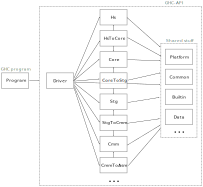

Motivation
==========

This is an ongoing effort to make GHC more modular.

* Make the pipeline more reusable.
    * For historical reasons, the current codebase assumes a straight pipeline from Haskell files to Cmm.
    * Clash and IHC forks after Core, GHCJS forks after Stg, Asterius forks after Cmm, etc. We could imagine other languages targeting Core, Stg or Cmm. They often can't use GHC-API from a stock GHC and rely on a forked GHC instead.
    * I would like to have an interactive frontend that can explore different optimizations order, etc. Currently GHC-API doesn't make it simple/possible to do.
    * A Unison-like frontend for GHC would be very cool but it would break many assumptions about file organization, packages, etc.

* Test independent parts of the compiler with "modern" tools (QuickCheck, etc.).
    * Compare IR expressions instead of IR dumps: faster, avoid fragile output canonicalization
    * Make the testsuite faster: don't execute the whole pipeline
    * Catch more bugs/regressions maybe
    * Provide Criterion reports (checked in CI?)

* Make GHC multi-sessions, multi-targets, multi-threaded...
    * It will be easier with constrained side-effects and a more modular code-base

Principles
==========

1. Make the different stages of the pipeline usable independently from each other
2. Avoid shared mutable state and uncontrolled side-effects
3. Clearly separate GHC-the-program from GHC-API

Tasks
=====

Make the pipeline apparent in the module hierarchy (#13009)
-----------------------------------------------------------

We would like to introduce the following module prefixes:



The boxes are the GHC.XXX top-level module prefixes. The arrows indicate allowed dependencies between groups of modules.

Principles:
* Consider top-level modules GHC.XXX as if they were from independent packages
* Put together modules defining, transforming and analyzing each IR: GHC.{Hs,Core,Stg,Cmm,Iface,Llvm,etc.}
* Put each IR-to-IR compiler under top-level "GHC.Ir1ToIr2" (e.g. GHC.StgToCmm)

Goals:
* Group all the GHC modules under the GHC prefix (common convention for Haskell packages, least surprise)
* Ensure that each IR can be used independently from the others
* Improve the generated Haddocks (table of contents reflecting the hierarchy)

Reduce the dependencies on DynFlags
-----------------------------------

DynFlags is a huge (mutable) datatype that is passed to many functions in the compiler. We can make the transition smoother by defining the following kind of classes and instances:

```
-- in GHC.StgToCmm.Options
class HasStgToCmmOptions a where
   stgToCmmXXX :: Bool
   ...

data StgToCmmOptions = StgToCmmOptions
   { _stgToCmmXXX :: Bool
   , ...
   }

stgToCmm :: HasStgToCmmOptions a => a -> Stg -> Cmm

-- in GHC.Driver.Options
instance HasStgToCmmOptions DynFlags where
   ...

```


Make the compiler as pure as possible
-------------------------------------

* IR-to-IR should callback into the driving code to perform IO (e.g. when they need an interface to be loaded). They can return a continuation to resume their work.
* Don't assume that a filesystem is present (i.e. make the Finder configurable, like Java's class loaders). It will make life easier for IDEs.
* Support multi-sessions (#10827)
