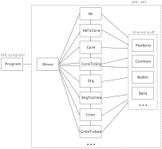

Motivation
==========

This is an ongoing effort to make GHC more modular.

* Make the pipeline more reusable.
    * For historical reasons, the current codebase assumes a straight pipeline from Haskell files to Cmm.
    * Clash and IHC forks after Core, GHCJS forks after Stg, Asterius forks after Cmm, etc. We could imagine other languages targeting Core, Stg or Cmm. They often can't use GHC-API from a stock GHC and rely on a forked GHC instead.
    * I would like to have an interactive frontend that can explore different optimizations order, etc. Currently GHC-API doesn't make it simple/possible to do.
    * A Unison-like frontend for GHC would be very cool but it would break many assumptions about file organization, packages, etc.

* Test independent parts of the compiler with "modern" tools (QuickCheck, etc.).
    * Compare IR expressions instead of IR dumps: faster, avoid fragile output canonicalization
    * Make the testsuite faster: don't execute the whole pipeline
    * Catch more bugs/regressions maybe
    * Provide Criterion reports (checked in CI?)

* Make GHC multi-sessions, multi-targets, multi-threaded...
    * It will be easier with constrained side-effects and a more modular code-base

Principles
==========

1. Make the different stages of the pipeline usable independently from each other
2. Avoid shared mutable state and uncontrolled side-effects
3. Clearly separate GHC-the-program from GHC-API

Tasks
=====

Make the pipeline apparent in the module hierarchy (#13009)
-----------------------------------------------------------

We would like to introduce the following module prefixes:



The boxes are the GHC.XXX top-level module prefixes. The arrows indicate allowed dependencies between groups of modules.

Principles:
* Consider top-level modules GHC.XXX as if they were from independent packages
* Put together modules defining, transforming and analyzing each IR: GHC.{Hs,Core,Stg,Cmm,Iface,Llvm,etc.}
* Put each IR-to-IR compiler under top-level "GHC.Ir1ToIr2" (e.g. GHC.StgToCmm)

Goals:
* Group all the GHC modules under the GHC prefix (common convention for Haskell packages, least surprise)
* Ensure that each IR can be used independently from the others
* Improve the generated Haddocks (table of contents reflecting the hierarchy)

Proposed hierarchy:
```
-- IRs
GHC.Hs
GHC.Core
GHC.Stg
GHC.Cmm
GHC.Iface
GHC.Bytecode
GHC.Llvm

-- Compilers
GHC.HsToCore
GHC.CoreToStg
GHC.StgToCmm
GHC.CmmToAsm
GHC.CmmToC
GHC.CmmToLlvm
GHC.CoreToIface
GHC.CoreToBytecode

GHC.Driver: pipeline driver (Backpack, Finder, Main, Make, MakeDepend, etc.)
GHC.Program: command-line parsing, GHCi UI, etc.

-- shared stuff
GHC.Builtins: primops, etc.
GHC.Data: data structures (Bag, Graph, FiniteMap, EnumSet, etc.)
GHC.Common (Id, Name, etc.)
GHC.{Runtime/Interactive}: interactive evaluation stuff (Debugger, Eval, etc.)
GHC.Plugin
GHC.Utils: SysTools, IO stuff, Outputable, etc.
GHC.Platform: platform description (register mapping, word-size, etc.)
GHC.Config: Constants, DynFlags, etc.
```

Proposals by @simonpj and @rae:

* Add top-level modules for IR internal transformations (e.g. GHC.CoreToCore, GHC.StgToStg).
    * I don't understand the principle that would suggest putting these operations into specific top-level modules. As a counter example, "Subst" is also a Core-to-Core transformation but doesn't really belong in GHC.CoreToCore (or does it?).
    *  By the "top-level module ~ package" analogy above, I would prefer if they were under the IR they operate on (GHC.Core, GHC.Stg, etc.). It is less verbose and it is obvious that modules under GHC.XX operate on XX.
    * If a distinction for "passes" is to be made, I would prefer something like `GHC.Core.Pass.XY` (2 years ago I suggested we should make the distinction between GHC.Core.{Syntax,Analyzers,Transformers} but it was deemed too verbose, which it is indeed).

* Add top-level GHC.Parse, GHC.Rename, GHC.Typecheck
    * Same argument from me: these modules operate on the "Hs" representation so to me it makes more put them under `GHC.Hs`:
        * GHC.Hs.Parser: similar to other IR which have a parser
        * GHC.Hs.{Rename,Typecheck}
        * Even extract `GHC.Hs.Derive` from the current type-checker

Reduce the dependencies on DynFlags
-----------------------------------

DynFlags is a huge (mutable) datatype that is passed to many functions in the compiler. We can make the transition smoother by defining the following kind of classes and instances:

```
-- in GHC.StgToCmm.Options
class HasStgToCmmOptions a where
   stgToCmmXXX :: Bool
   ...

data StgToCmmOptions = StgToCmmOptions
   { _stgToCmmXXX :: Bool
   , ...
   }

stgToCmm :: HasStgToCmmOptions a => a -> Stg -> Cmm

-- in GHC.Driver.Options
instance HasStgToCmmOptions DynFlags where
   ...

```


Make the compiler as pure as possible
-------------------------------------

* IR-to-IR should callback into the driving code to perform IO (e.g. when they need an interface to be loaded). They can return a continuation to resume their work.
* Don't assume that a filesystem is present
    * Abstract file loading (i.e. make the Finder configurable, like Java's class loaders).
    * Abstract error reporting and logging (i.e. pluggable Logger)
    * It will make life easier for IDEs and other frontends.
* Support multi-sessions (#10827)
