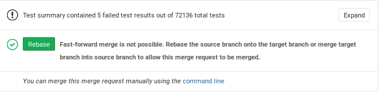

[Marge Bot](https://gitlab.haskell.org/ghc/marge-bot) is the bot that we use to merge patches. 

Once a patch is accepted then it is assigned to @marge-bot and she will merge your patch for you. If you do not have commit access, ask someone in #ghc to assign the patch to @marge-bot for you.

Marge checks every 30 minutes to see if there are at least 2 pull requests for the same branch to merge. If there is some work to do then she will create a batch, once the batch passes CI then she will 
push each patch one at a time until they all land on master.

A MR will be added to the batch if:

1. It has at least one approval
2. CI for the MR is already passing
3. The status of the MR is not WIP

Marge will not squash your commits for you. The option to squash commits together is ignored. The person who assigns Marge to a MR should ensure that the commit history is suitably squashed before assigning Marge. 

Once the batch passes, one patch every 5 minutes will be merged until there is no more work to be done. This delay is due to a race condition in the gitlab rebase API which makes it difficult to 
predict when the evidence of a rebase will actually become evident from inspecting the git remotes.

# What not to do

## Rebase your patch

Once you MR is assigned to Marge do not rebase the patch unless there are merge conflicts. Gitlab's UI is confusing here as it suggest that you rebase the patch even when it is pointless. Marge will rebase your patch for you.

## Merge a patch yourself

Do not manually merge patches to master unless you know what you are doing. Merging patches
to master invalidates a whole marge batch. 

