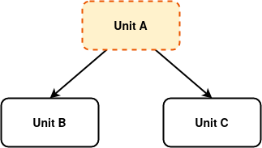
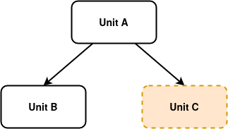

This page is to track work by @DanielG and @mpickering on making GHC work better for the interactive tooling use-case. This is part of @DanielG's GSoC 2019 project: [A stronger foundation for interactive Haskell tooling](https://summerofcode.withgoogle.com/projects/#6687588310581248), see *Section 2* in [the proposal (PDF)](http://dxld.at/gsoc19.pdf) for the original motivation.
The page also tracks the work by @fendor, @Ericson2314 and @mpickering to enable GHC and GHCi to support multiple home packages. This is part of @fendor's GSoC 2020 project: [Multiple Home Packages for GHC](https://summerofcode.withgoogle.com/projects/#5269390116782080)

The primary goal is

> It should be possible to use multiple GHC API [`Session`s](https://hackage.haskell.org/package/ghc-8.6.5/docs/GhcMonad.html#t:Session) in a single process concurrently. 

This functionality is important for tooling such as `haskell-ide-engine` which needs to deal with giving feedback to user's on multiple different projects simultaneously. Orchestrating this from a single process is 
simpler and more efficient. 

# Current Situation

Lot's of arbitrary restrictions within GHC:
 - One GHC "session" per process
    - Global linker state with GHCi/TH
 - One package being built per "session"

# Desired API

No arbitrary restrictions:
 - Multiple sessions per process
 - Multiple packages per session
 - No global linker state

Eventually, enough state should be removed that the notion of a "session" at all is purely optional: just for caching and code execution (ghci/TH). This, strictly speaking is out of scope of this feature, but keeping such a goal like in mind may be help in guiding efforts.

# Work to do

- GSOC proposal proposed focusing on multiple sessions per process
  - Remove singleton state where appropriate
  - Cross fingers on linker MR (!388) but use `-fexternal-interpreter` as a workaround (per-process linker state cordoned off in iserv processes).
- !935 modifies `HscEnv` to solve the packages per session
  - Better UX when developing multiple *related* packages, and changes in dependencies should be propagated downstream
  - Also needed for multi-package code execution (vs meerly using GHCi for fast type checking)
- !388 solves the linker problem, or at least the haskell (vs C) part of it?

# Multiple Packages per session (!935)

## Motivation

Primary goal:

> Enable GHC and GHCi to work with multiple units at once.

Most importantly to the end user, this allows development of multiple units in GHCi. There are other workflows which can benefit from such functionality, such as incremental compilation and Haskell Language Server.

Original GSoC 2020 proposal: [HomePackages.pdf](uploads/4d52e9f036c25a5d33928def7deddb7b/HomePackages.pdf)
Slides for HiW 2020 "Multiple Home Units" by Hannes Siebenhandl: [Home_Units_HiW_2020.pdf](uploads/b0d20435e5ea7acabeedc8cdb57ba722/Home_Units_HiW_2020.pdf)

## Architectural changes

The important change is to `HscEnv`, where we extract the DynFlags and Home Package Table, into a Map from `UnitId -> InternalUnitEnv`. 
The Internal UnitEnv itself is a tuple of DynFlags and Home Package Table (HPT). It contains all information necessary to compile the package identified by its Unit Id.

Main Change is to replace the code:
```haskell
data HscEnv
 = HscEnv {

       hsc_dflags :: DynFlags,

       hsc_HPT :: HomePackageTable,

       ...
       }
``` 
with 
```haskell
type UnitEnv = UnitEnvGraph InternalUnitEnv

data UnitEnvGraph v = UnitEnvGraph
  { unitEnv_graph :: !(Map UnitId v)
  , unitEnv_currentUnit :: !UnitId
  }

data InternalUnitEnv = InternalUnitEnv
  { internalUnitEnv_dflags :: DynFlags
  , internalUnitEnv_homePackageTable :: HomePackageTable
  }

data HscEnv
  = HscEnv {

        hsc_internalUnitEnv :: UnitEnv,
                -- ^ Information per package / unit, for "internal" (not already
                -- installed) units.
        ...
 }
```


To maintain backwards compatibility (e.g. dont break almost every GHC API program in existence), we additionally save the currently "active" home unit in `HscEnv` in the field `hsc_currentUnit`. This way, the existing functions `hsc_dflags` and `hsc_HPT` can continue to function. Note, however, that this will still break a lot of GHC API programs, as these functions have been demoted from fields to ordinary functions. Anything that modifies the `HscEnv` directly will, thus, fail.

The Design of `hsc_currentUnit` is reasonable, but entails some statefulness that is far from optimal.
Within GHC, we will need a thourogh guideline, when to use `hsc_dflags` or `hsc_HPT`, and when to pass in the explicit unit-id, which can be used to query the Internal Unit Env for the appropriate DynFlags/HPT.

## Changes to Finder

The finder needs to know in which HPT it should look for home modules.
Therefore, a lot of changes are to add an explicit unit-id parameter.
We prefer this approach over modifying the `hsc_currentUnit` field.

## Compilation

Compilation with multiple home-modules works very similar to with a single package. 
Essentially, we now have a set of targets annotated with unit-ids. We can search for each of these targets and let the downsweep/upsweep do its thing. The only real change we do is to modify the ModSummary to include the DynFlags from the UnitId saved in the Internal UnitEnv. This is necessary for the compilation later, where we might have a different unit state. Therefore, before compiling a module, we have to change the currently active unit (hsc_currentUnit), to the `homeUnitId` saved in ModSummary.

The Finder logic needs to be adapted to be able to find the different modules and especially when we are looking only for "some" module, we have to look everywhere:

* In the unit-state/EPS
* In every HPT that is currently saved in the UnitEnv

Reliance on functions such as `hsc_dflags` is discouraged, to avoid stateful function calls. Use whenever possible the explicit parameter `UnitId` and lookup the required information via `hsc_unitDflags` or pass in directly DynFlags.
(Is this the best approach?)

## Linking

It is up for debate, whether we should be able to produce a single executable, e.g. only from unit id `main`, or from any home package that declares that it wants to produce an executable.

Linking is complicated. For linking an executable, we need each dependency of the executable as a `UnitInfo` which is information retrieved from the unit database. However, one of our dependencies might be a local home unit, for which there is no information in the unit database. For linking, we could build a UnitInfo out of the HPT and DynFlags, and link it into the executable.
For a first step, it can be enough to just compile every home package and produce the required artefacts. In a separate step we may link the various executables as a first step.

## GHC CLI

We propose two new major modes for GHC:

```sh
ghc -unit @unitA -unit @unitB ... -unit @unitZ
```
The argument `@<filepath>` uses [response files](https://hackage.haskell.org/package/base-4.14.0.0/docs/GHC-ResponseFile.html), where `<filepath>` is a file that contains all the compilation options necessary to compile the home unit. 
As noted in the linking section, no final binary can be created for home units that have dependencies on other home units.

With the shown invocation, we invoke GHC in `make` mode.

For opening an interactive session, almost the same CLI can be used:
```sh
ghc --interactive -unit @unitA -unit @unitB ... -unit @unitZ
```

It uses [response files](https://hackage.haskell.org/package/base-4.14.0.0/docs/GHC-ResponseFile.html) as well and the last given unit argument becomes the *main active* unit. 

## GHCi UI

We introduce three new UI commands that are helpful for defining tests and evaluating code within the interactive session:

* `:setunit <unit-id> <ghc-option>*`: Set the compilation options for the given `<unit-id>`. If the given unit id is unknown, it will be created. This command can be used to define ad-hoc home units and adding them to the interactive session.
* `:addunit <unit-id> <target>*`: Add targets to the global module graph that are located in the given unit id.
* `:switch <unit-id>`: Switch the current main unit to `<unit-id>`.

Every code-evaluation is relative to the *main active* home unit. This is necessary to avoid ambiguity if multiple home units define the same identifier. It is possible to change the main home unit by using the GHCi command `:switch <unit-id>`.

Example 1:



Here `Unit A` is the main active home unit, therefore, the user has definitions and dependencies of `Unit A` in scope and can evaluate code, as if you only had opened the unit `Unit A` in the interactive session. Changes to `Unit B` and `Unit C` will cause recompilation of dependant modules.

Example 2:



Now `Unit C` is the main active home unit. The important difference is that there is no definition from `Unit A` or `Unit B` in scope for the interactive evaluation, and neither are their dependencies.

### Alternative Design Idea

As we probably can all agree on, statefulness is a root of evil and this is no exception. Explaining this GHCi behaviour to new users is probably close to impossible, and even advanced users might struggle (and disagree) with this decision. 

We also briefly considered a different design space, which we considered a worse solution:

Create an additional home unit that has an explicit dependency on all other home units. This way, the ghci session would be more declarative, since you could just evaluate definitions from any home unit, but it would be harder to disambiguate identifiers that are defined in different home units. Moreover, it would be awkward to figure out, which dependencies should be in scope. In general, it felt like a hack, and not worth pursuing.

I would be happy about a discussion which design is more appropriate for GHCi.

## Limitations

There are two open issues that can not be solved within this MR and must be taken care of in subsequent work. Merging does not depend on these issues though.

### Module visibility

Cabal packages usually define private and public modules, and packages can depend on the latter. Before this MR, this did not matter to the interactive session, as it was only possible to open a single component/package and a package can import its private modules. 
Therefore, there was no need for GHC to have an explicit notion of private/public modules and it just assumes that all modules are public.
However, with multiple home units, the following situation might arise:


The important issue is that module `D` might depend on module `C`, although `C` is private to `Unit Y` and it should not be possible for `Unit X` to depend on the private modules of `Unit Y`. Therefore, we might accept programs that are not valid for a cabal package. However, we do not expect real-world problems as long as tools, such as `cabal`, make sure a package only imports public modules.

A potential way to solve this issue, is to make GHC understand module visibility. In particular, we would need to extend the command line interface to specify the visibility of a module and dependency resolution needs to detect invalid imports. In theory, this should not be difficult, as GHC already understands when a user imports private modules from external packages and provides helpful error messages.

### Package Imports

The language extension [`Package Imports`](https://downloads.haskell.org/~ghc/latest/docs/html/users_guide/glasgow_exts.html?highlight=package%20imports#extension-PackageImports) is used to resolve ambiguous imports from different units. In particular, to help disambiguate importing two modules with the same name from two different units.

Example:
```haskell
import "foo" Data.Foo
import "bar" Data.Foo
```

It uses the package name for the disambiguation. The problem is that the package-name is read from disk and for home units, there is no such information on disk, therefore this feature can not work at the moment. A home unit is specified as a unit-id in the cli flag and looke like `-package-id <unit-name>-<version>-<hash>`. There is currently no way get the name of the package in a standardised way. One way to solve this would be to create a name-scheme for unit ids, but this proposal is out of scope for this project. 

## Legacy support

### Usage of `hsc_dflags` and `hsc_HPT`

These have been demoted from fields in `HscEnv` to ordinary functions.
Therefore, a lot of existing code that modified `HscEnv`'s record might break.
Within GHC, any occurrence of `hsc_dflags` and `hsc_HPT` needs to be reviewed individually, as any usage of these functions must be considered outdated in the face of multiple home packages.

### Updating the Internal Unit Environment

Initially we are creating an empty Unit Environment:
```haskell
UnitEnv:
  main -> {}
```

where the name "main" is defined by `homeUnitId` which is specified by "-this-unit-id" or defaults to "main". Additionally, it points to an empty HPT by default.

The problem is when users now modify the `homeUnitId`(part of DynFlags) and then call `setSessionDynFlags` to change the active DynFlags.
We need to change the key (hsc_currentUnit) and rename the old key to the new within the internal UnitEnv, as well, otherwise we will face breaking user code a lot.

## Migration Guide for Users

There will be no backwards compatibility story, since this change touches too many places.

The functionality of existing GHC API programs will remain vastly unchanged.
A few replacements will be necessary though:

* Replace record updates of HscEnv with `set_hsc_dflags` and `set_hsc_HPT` respectively.
* Usage of RecordWildCards on HscEnv will no longer work for `hsc_dflags` and `hsc_HPT`. They always must be applied to HscEnv.
* Targets have an additional field now. The field can be obtained by querying `homeUnitId_` from `getSessionDynFlags`.
* Modifying `DynFlags` in a session requires a call to `setSessionDynFlags` so that the Internal Unit Env will be updated appropriately, in case of changes to `homeUnitId_`.

Other than that, we expect that nothing else needs to be modified to compile with only a single home package table.

# Related MRs

* https://gitlab.haskell.org/ghc/ghc/merge_requests/388 (Allow multiple linker instances)
* https://gitlab.haskell.org/ghc/ghc/merge_requests/935 (Start multi-package support)
* https://gitlab.haskell.org/ghc/ghc/-/merge_requests/3950 (Implement Multiple Home Units for GHC)