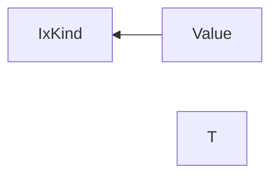
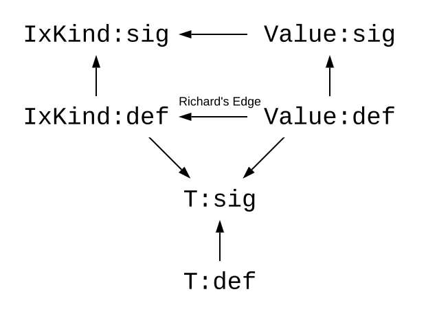
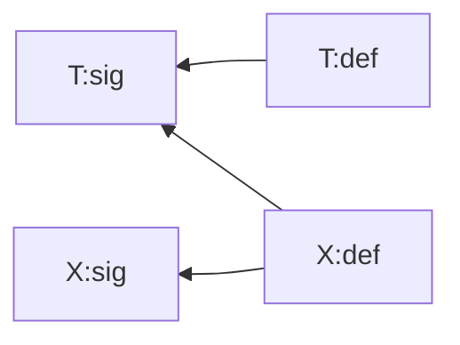
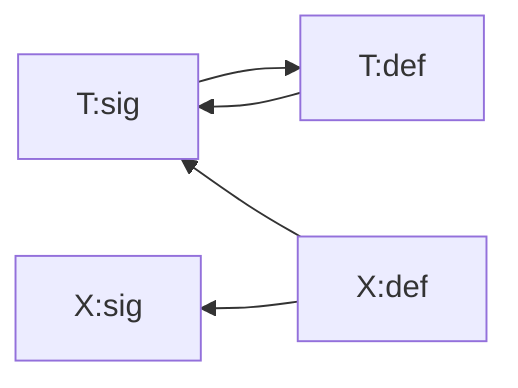
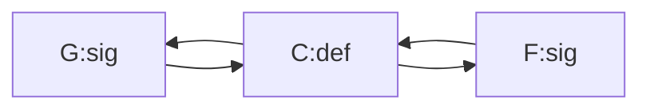
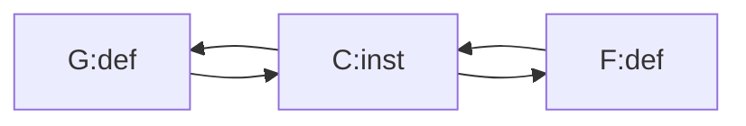

# Type & Class Dependency Analysis

## Background: The `HsGroup` Story

In GHC, every Haskell module is split into so-called `HsGroup`s. The boundaries of these groups are determined by top-level `TemplateHaskell` declaration splices (see `findSplice` in `GHC.Rename.Source`).

For example, here we have two `HsGroup`s:

```haskell
data A
x = 5

$(return [])

data B
```

The first `HsGroup` contains `data A` and `x = 5`, and the second `HsGroup` contains `data B`.

It is impossible to refer to a name defined in a later `HsGroup`: 

```
data A = MkA B  -- error, B is not visible here
$(return [])
data B
```

The boundary this creates has significant implications for the Template Haskell code that runs in-between. A splice can only reify types and declarations that are defined in preceding groups, and the declarations it generates are only visible in the groups that follow.

Consider the following program:

```
data Nat = Zero | Succ Nat
$(genSingletons [''Nat])
data SomeNat = forall n. SomeNat (SNat n)
```

Here, `genSingletons` can reify a declaration from a preceding group (`Nat`), and the declaration it generates (`SNat`) is used in a group that follows.

Swapping these lines would break the program:

```
data SomeNat = forall n. SomeNat (SNat n)  -- Error: SNat not available here.
$(genSingletons [''Nat])                   -- Error: Nat not available here.
data Nat = Zero | Succ Nat
```

In other words, when it comes to `HsGroup`s, GHC does not try to be smart and reorder anything. Splices are processed in a top-to-bottom order. And even when a splice is a no-op (`$(return [])`), it still introduces a boundary.

This is simple and predictable. However, it can also be inconvenient. For example:

```
data Foo = MkFoo { ... }
makeLenses ''Foo

fn a b c = ... -- Cannot use `Bar` lenses here! :-(

data Bar = MkBar { ... }
makeLenses ''Bar
```

This is not considered a major issue.

## The `TyClGroup` Story

Within one `HsGroup`, the order of declarations should not matter. These programs should both work:

```
data X = MkX
data Y (a :: X)
```

```
data Y (a :: X)
data X = MkX
```

The definition of `Y` depends on `X`. Both examples are valid, even though in the latter one `X` is defined after `Y`. This works because the renamer handles the entire `HsGroup` at once. It collects the identifiers bound by every LHS, brings them into scope, and then does name resolution in another pass over the declarations.

The type-checker (kind-checker, really) cannot work this way. In the example above, kind-checking `Y` requires an already kind-checked `TyCon` for `X`. So the kind-checker needs to process declarations in a specific order, with mutually-recursive declarations grouped together.

That's why within every `HsGroup`, after renaming and before type-checking, we perform dependency analysis, producing `TyClGroup`s.

A `TyClGroup` is defined thus:

```
-- | Type or Class Group
data TyClGroup pass  -- See Note [TyClGroups and dependency analysis]
  = TyClGroup { group_ext    :: XCTyClGroup pass
              , group_tyclds :: [LTyClDecl pass]
              , group_roles  :: [LRoleAnnotDecl pass]
              , group_kisigs :: [LStandaloneKindSig pass]
              , group_instds :: [LInstDecl pass] }
  | XTyClGroup (XXTyClGroup pass)

type instance XCTyClGroup (GhcPass _) = NoExtField
type instance XXTyClGroup (GhcPass _) = NoExtCon
```

Therefore, it contains zero or more of the following:

* data and newtype declarations (e.g. `data T = ...`)
* type synonyms (e.g. `type T = ...`)
* class declarations (e.g. `class C a where ...`)
* class instances (e.g. `instance C Int where ...`)
* closed type families (e.g. `type family F a where ...`)
* open type family headers (e.g. `type family F a`)
* open type family instances (e.g. `type instance F Int = ...`)
* data family headers (e.g. `data family D a`)
* data family instances (e.g. `data instance D Int = ...`)
* standalone kind signatures (e.g. `type T :: ...`)
* role annotations (e.g. `type role F nominal`)

It does not contain term-level declarations (e.g. `x = 5`), term-level type signatures (e.g. `x :: Int`), or any other varieties of declarations.

The purpose of the type and class dependency analysis is to take a list of declarations in the order that they appear in the source file and to sort them into `TyClGroup`s in such a way that kind-checking any given `TyClGroup` requires type constructors from preceding groups only.

For example, if the user writes:

```
data Y (a :: X)
data X = MkX
```

Then the `TyClGroup`s are:

1. `data X = MkX`
2. `data Y (a :: X)`

Kind-checking `Y` requires the type constructor `X`, so `X` must be put into a preceding `TyClGroup`.

## Dependency Analysis in GHC 8.10

As of GHC 8.10, the dependency analysis that builds `TyClGroup`s works as follows:

1. Build a directed graph where the nodes are `TyClDecl`s, the keys identifying those nodes are `Name`s, and the edges are free variables.

    For example:

    ```
    data A = MkA1 B | MkA2
    data B = MkB (Y A)
    type family F a
    type instance F (Y _) = Bool
    data Y a = MkY (F a)
    ```


    ```mermaid
    graph RL;
      A --> B
      B --> A
      B --> Y
      Y --> F
    ```

    Note that the type family instance is not subject to dependency analysis at this stage of the pipeline.

2. Do the SCC (strongly-connected component) analysis on the graph, producing `[[TyClDecl GhcRn]]`:

   1. ```haskell
      type family F a
      ```
   2. ```haskell
      data Y a = MkY (F a)
      ```
   3. ```haskell
      data A = MkA1 B | MkA2
      data B = MkB (Y A)
      ```

3. Go over these `[[TyClDecl GhcRn]]`, adding instances as soon as all of their free variables are available. For example, `type instance F (Y _) = Bool` has free variables `Y`, `Bool`, so it will be added to the group which introduces `Y`.

   At this point we produce the final `[TyClGroup]`:

   1. ```haskell
      type family F a
      ```
   2. ```haskell
      data Y a = MkY (F a)
      type instance F (Y _) = Bool
      ```
   3. ```haskell
      data A = MkA1 B | MkA2
      data B = MkB (Y A)
      ```

   At this stage we also handle role annotations and standalone kind signatures in a manner similar to instances, adding them after the graph has already been built.

## Instances in Kind-Checking, #12088

The `TyClGroup` analysis in 8.10 has a fatal flaw: it does not account for type family instances during dependency analysis, adding them at a later step.

However, those instances might be required to kind-check declarations. Consider this example:

```
{-# LANGUAGE KindSignatures, PolyKinds, DataKinds, TypeFamilies #-}

import Data.Kind (Type)

type family IxKind (m :: Type) :: Type
type family Value (m :: Type) :: IxKind m -> Type
data T (k :: Type) (f :: k -> Type) = MkT
type instance IxKind (T k f) = k
type instance Value (T k f) = f
```

Here, we build the following dependency graph:


We then produce the following `TyClGroup`s:

1. ```haskell
   type family IxKind (m :: Type) :: Type
   ```
2. ```haskell
   type family Value (m :: Type) :: IxKind m -> Type
   ```
3. ```haskell
   data T (k :: Type) (f :: k -> Type)
   type instance IxKind (T k f) = k
   type instance Value (T k f) = f
   ```

The issue here is that kind-checking `type instance Value` requires the `type instance IxKind` to be already in the environment. To see why, let's write out the kind signature on the right-hand side:

```haskell
type instance Value (T k f) = (f :: k -> Type)
```

However, the kind signature of `Value` is such that it must return `f :: IxKind (T k f) -> Type` here. So we unify `IxKind (T k f) ~ k`.

To make progress now, we need to reduce `IxKind`, and for this we need `type instance IxKind (T k f) = k`. But it's not available because it does not come from a preceding `TyClGroup`.

The question is: how can we account for instances during dependency analysis to make this (and other, more complicated cases) work correctly?


## The `:sig` and `:def` Notation

To answer this question, we will first introduce the idea of *signatures* and *definitions*. Roughly speaking, a signature corresponds to the left-hand side of a declaration, giving the kind of a `TyCon`, whereas the definition corresponds to the right-hand side and gives all the other information about it:

```haskell
data Either a b = Left a | Right b
     ^^^^^^^^^^   ^^^^^^^^^^^^^^^^
      sig            def

type family F a; type instance F Int = Bool;
                 type instance F Bool = Int;
  ^^^^^^^^^^^^^                ^^^^^^^^^^^^ 
    sig                           def              
```

Notably, this model implies grouping together all instances of a given type/data family or class, and treating them as a single unit. In the example above, `F:def` includes both `type instance F Int` and `type instance F Bool`.

In the dependency analysis, we want to produce separate nodes for the signatures and definitions. Recall the `IxKind` example:

```haskell
{- IxKind:sig -} type family IxKind (m :: Type) :: Type
{-  Value:sig -} type family Value (m :: Type) :: IxKind m -> Type
{-      T:sig -} data T (k :: Type) (f :: k -> Type)
{-      T:def -}   = MkT                   
{- IxKind:def -} type instance IxKind (T k f) = k
{-  Value:def -} type instance Value (T k f) = f
```

To produce the edges, we will start with the following simple rules:

* Every `:def` depends on the corresponding `:sig`
* Referencing a type constructor adds a dependency on its `:sig`
* Referencing a promoted data constructor adds a dependency on its parent's `:def` (not demonstrated in this example)

We thus produce the following dependency graph:


However, this is not sufficient to fix this example. We introduce one more rule, proposed by Richard Eisenberg:

* For any edge `A:sig -> B:sig`, add another edge `A:def -> B:def`.



This set of rules results in the following `TyClGroup`s:

1. ```haskell
   {- IxKind:sig -} type family IxKind (m :: Type) :: Type
   ```
2. ```haskell
   {-  Value:sig -} type family Value (m :: Type) :: IxKind m -> Type
   ```
3. ```haskell
   {-      T:sig -} data T (k :: Type) (f :: k -> Type)
   ```
4. ```haskell
   {-      T:def -}   = MkT 
   ```
5. ```haskell
   {- IxKind:def -} type instance IxKind (T k f) = k
   ```
6. ```haskell
   {-  Value:def -} type instance Value (T k f) = f
   ```

## CUSKs and Phantom Nodes

In the last example, we split a single declaration into two parts:

```
{-      T:sig -} data T (k :: Type) (f :: k -> Type)
{-      T:def -}   = MkT 
```

The result is that `T:sig` and `T:def` end up in different `TyClGroup`s. However, it is not always valid to do this split. Sometimes, we expect the RHS to influence the kind of the type constructor via kind inference:

```
data T a = MkT a
```

If we did the split here, we would infer `T :: forall k. k -> Type` by considering `T:sig` alone. And then we would reject `T:def` because it expects `a :: Type`, not `a :: k`.

We can safely put `T:sig` into a separate group only when the kind can be determined without inference, by looking at the so-called [Complete User-Supplied Kind](https://downloads.haskell.org/~ghc/8.10.1/docs/html/users_guide/glasgow_exts.html#complete-user-supplied-kind-signatures-and-polymorphic-recursion) (CUSK).

This means that in absence of a CUSK, we must keep both the LHS and the RHS as part of `T:def`, and we cannot extract a standalone `T:sig`:

```
{- T:sig -}
{- T:def -} data T a = MkT a
```

However, other declarations may have edges to `T:sig`:

```
data T a = MkT a
data X = MkX (T Int)
```

Normally, we would build the following dependency graph:



But since `T` has no CUSK, there's nothing we can put into its `T:sig` node! As a workaround, we generate an empty `:sig` node with an edge to the `:def` node:



We'll call such `:sig` nodes phantom. That is, a **phantom node** is an empty node with an edge to the node with actual content. Phantom `:sig` nodes are created for any declarations that require kind inference and cannot have proper standalone `:sig` nodes.

When we build the final `TyClGroup`s, a phantom node will not contribute any additional data. It is only useful during dependency analysis. Effectively, it turns any `... -> T:sig` edge into a `... -> T:def` edge by utilizing transitivity. You can think of them as redirects.

## Associated Types and `:inst` Nodes

Another tricky case is associated types. Consider the following declaration:

```
class C a where   -- C:def
  type F a        -- F:sig
  type G a        -- G:sig
```

`F:sig` and `G:sig` are part of `C:def` and will not be processed separately. This is another use case for phantom nodes:


The entire payload will be contained in the `C:def` node, whereas `F:sig` and `G:sig` will simply redirect to it.

But what about instances?

```
instance C Int where
  type F Int = Bool     -- F:def
  type G Int = String   -- G:def
```

Here, `F:def` and `G:def` are part of an instance of `C`. To handle this case, we need to introduce a new type of nodes, `:inst` nodes:

```
instance C Int where    -- C:inst
  type F Int = Bool     -- F:def
  type G Int = String   -- G:def
```



The entire payload is contained in the `C:inst` node, whereas `F:def` and `G:def` are phantom.

## The `TcTyCon` Issue

Consider this program:

```
{-# LANGUAGE StandaloneKindSignatures, DataKinds #-}

import Data.Kind (Type)

type T :: Type
data E = MkE T
data T
```

We generate the following TyClGroups:

1. `type T :: Type`
2. `data E = MkE T`
3. `data T`

The problem is that checking `MkE T` expects a proper `TyCon` for `T`, not a `TcTyCon`. But checking the signature only gives a `TcTyCon`. This manifests as the following error:

```
 ghc: panic! (the 'impossible' happened)
   (GHC version 8.11.0.20200401:
   tcLookupGlobalOnly
   T
```

Furthermore, checking `data T` in the last group requires a `TcTyCon`. So, after checking the signature, we need to produce both a `TcTyCon` and a `TyCon`, and somehow add both to the environment.

Open type families and data families do not suffer from this issue, as processing their headers results in a proper `TyCon`. That's when the `:sig` and `:def` separation works great. However, for other varieties of declarations, the type checker is unable to process them separately.

Until this issue is resolved in the type checker, the dependency analysis mustn't make separate `:sig` and `:def` nodes for most declarations.