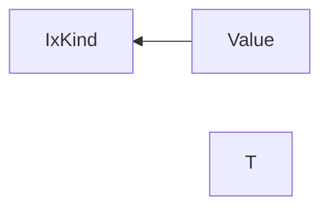
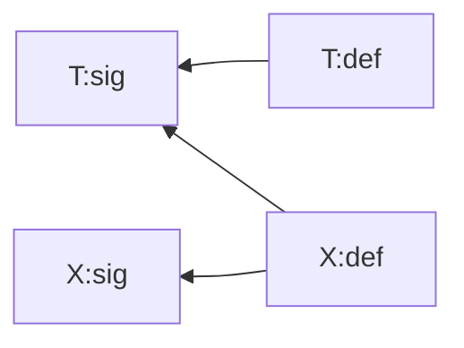
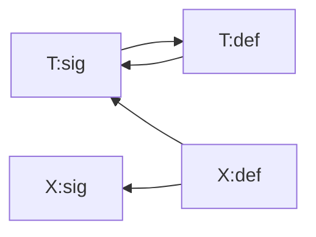
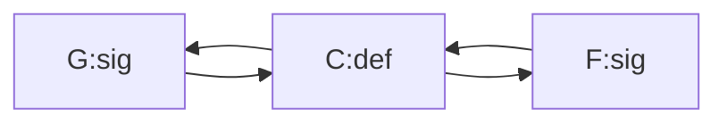
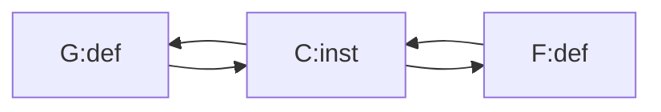
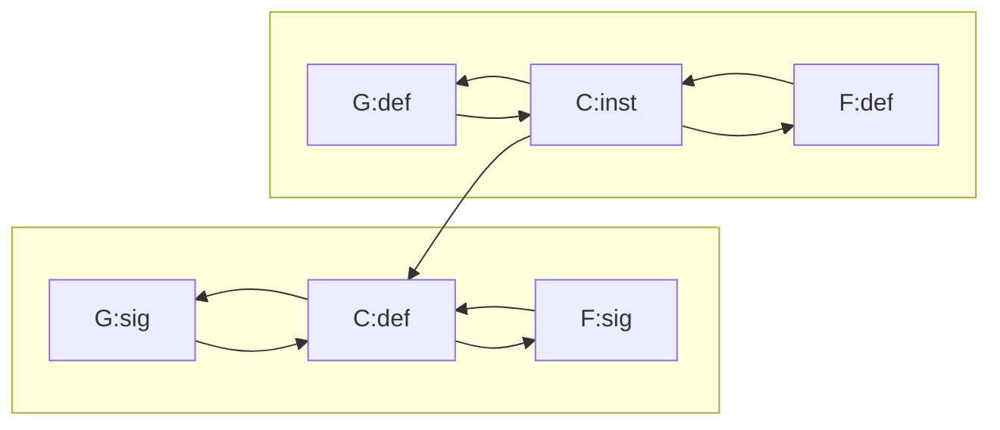
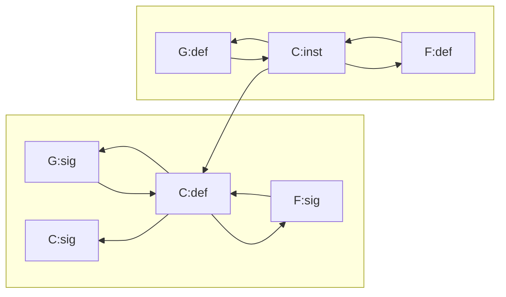

[[_TOC_]]

# Type & Class Dependency Analysis

## Background: The `HsGroup` Story

In GHC, every Haskell module is split into so-called `HsGroup`s. The boundaries of these groups are determined by top-level `TemplateHaskell` declaration splices (see `findSplice` in `GHC.Rename.Source`).

For example, here we have two `HsGroup`s:

```haskell
data A
x = 5

$(return [])

data B
```

The first `HsGroup` contains `data A` and `x = 5`, and the second `HsGroup` contains `data B`.

It is impossible to refer to a name defined in a later `HsGroup`: 

```haskell
data A = MkA B  -- error, B is not visible here
$(return [])
data B
```

The boundary this creates has significant implications for the Template Haskell code that runs in-between. A splice can only reify types and declarations that are defined in preceding groups, and the declarations it generates are only visible in the groups that follow.

Consider the following program:

```haskell
data Nat = Zero | Succ Nat
$(genSingletons [''Nat]) -- Generates `data SNat :: Nat -> Type where ...`
data SomeNat = forall n. SomeNat (SNat n)
```

Here, `genSingletons` can reify a declaration from a preceding group (`Nat`), and the declaration it generates (`SNat`) is used in a group that follows.

Swapping these lines would break the program:

```haskell
data SomeNat = forall n. SomeNat (SNat n)  -- Error: SNat not available here.
$(genSingletons [''Nat])                   -- Error: Nat not available here.
data Nat = Zero | Succ Nat
```

In other words, when it comes to `HsGroup`s, GHC does not try to be smart and reorder anything. Splices are processed in a top-to-bottom order. And even when a splice is a no-op (`$(return [])`), it still introduces a boundary.

This is simple and predictable. However, it can also be inconvenient. For example:

```haskell
data Foo = MkFoo { ... }
$(makeLenses ''Foo)

fn a b c = ... -- Cannot use `Bar` lenses here! :-(

data Bar = MkBar { ... }
$(makeLenses ''Bar)
```

This is not considered a major issue.

## The `TyClGroup` Story

Within one `HsGroup`, the order of declarations should not matter. These programs should both work:

```haskell
data X = MkX
data Y (a :: X)
```

```haskell
data Y (a :: X)
data X = MkX
```

The definition of `Y` depends on `X`. Both examples are valid, even though in the latter one `X` is defined after `Y`. This works because the renamer handles the entire `HsGroup` at once. It collects the identifiers bound by every LHS, brings them into scope, and then does name resolution in another pass over the declarations.

The type-checker (kind-checker, really) cannot work this way. In the example above, kind-checking `Y` requires an already kind-checked `TyCon` for `X`. So the kind-checker needs to process declarations in a specific order, with mutually-recursive declarations grouped together.

That's why within every `HsGroup`, after renaming and before type-checking, we perform dependency analysis, producing `TyClGroup`s.

A `TyClGroup` is defined thus:

```haskell
-- | Type or Class Group
data TyClGroup pass  -- See Note [TyClGroups and dependency analysis]
  = TyClGroup { group_ext    :: XCTyClGroup pass
              , group_tyclds :: [LTyClDecl pass]
              , group_roles  :: [LRoleAnnotDecl pass]
              , group_kisigs :: [LStandaloneKindSig pass]
              , group_instds :: [LInstDecl pass] }
  | XTyClGroup (XXTyClGroup pass)

type instance XCTyClGroup (GhcPass _) = NoExtField
type instance XXTyClGroup (GhcPass _) = NoExtCon
```

Therefore, it contains zero or more of the following:

* data and newtype declarations (e.g. `data T = ...`)
* type synonyms (e.g. `type T = ...`)
* class declarations (e.g. `class C a where ...`)
* class instances (e.g. `instance C Int where ...`)
* closed type families (e.g. `type family F a where ...`)
* open type family headers (e.g. `type family F a`)
* open type family instances (e.g. `type instance F Int = ...`)
* data family headers (e.g. `data family D a`)
* data family instances (e.g. `data instance D Int = ...`)
* standalone kind signatures (e.g. `type T :: ...`)
* role annotations (e.g. `type role F nominal`)

It does not contain term-level declarations (e.g. `x = 5`), term-level type signatures (e.g. `x :: Int`), or any other varieties of declarations.

The purpose of the type and class dependency analysis is to take a list of declarations in the order that they appear in the source file and to sort them into `TyClGroup`s in such a way that kind-checking any given `TyClGroup` requires type constructors from preceding groups only.

For example, if the user writes:

```haskell
data Y (a :: X)
data X = MkX
```

Then the `TyClGroup`s are:

1. `data X = MkX`
2. `data Y (a :: X)`

Kind-checking `Y` requires the type constructor `X`, so `X` must be put into a preceding `TyClGroup`.

## Dependency Analysis in GHC 8.10

As of GHC 8.10, the dependency analysis that builds `TyClGroup`s works as follows:

1. Build a directed graph where the nodes are `TyClDecl`s, the keys identifying those nodes are `Name`s, and the edges are free variables.

    For example:

    ```haskell
    data A = MkA1 B | MkA2
    data B = MkB (Y A)
    type family F a
    type instance F (Y _) = Bool
    data Y a = MkY (F a)
    ```


    ```mermaid
    graph RL;
      A --> B
      B --> A
      B --> Y
      Y --> F
    ```

    Note that the type family instance is not subject to dependency analysis at this stage of the pipeline.

2. Perform SCC (strongly-connected component) analysis on the graph, producing `[[TyClDecl GhcRn]]`:

   1. ```haskell
      type family F a
      ```
   2. ```haskell
      data Y a = MkY (F a)
      ```
   3. ```haskell
      data A = MkA1 B | MkA2
      data B = MkB (Y A)
      ```

3. Go over these `[[TyClDecl GhcRn]]`, adding instances as soon as all of their free variables are available. For example, `type instance F (Y _) = Bool` has free variables `Y`, `Bool`, so it will be added to the group which introduces `Y`.

   At this point we produce the final `[TyClGroup]`:

   1. ```haskell
      type family F a
      ```
   2. ```haskell
      data Y a = MkY (F a)
      type instance F (Y _) = Bool
      ```
   3. ```haskell
      data A = MkA1 B | MkA2
      data B = MkB (Y A)
      ```

   At this stage we also handle role annotations and standalone kind signatures in a manner similar to instances, adding them after the graph has already been built.

## Instances in Kind-Checking, #12088

The `TyClGroup` analysis in 8.10 has a fatal flaw: it does not account for type family instances during dependency analysis, adding them at a later step.

However, those instances might be required to kind-check declarations. Consider this example:

```haskell
{-# LANGUAGE KindSignatures, PolyKinds, DataKinds, TypeFamilies #-}

import Data.Kind (Type)

type family IxKind (m :: Type) :: Type
type family Value (m :: Type) :: IxKind m -> Type
data T (k :: Type) (f :: k -> Type) = MkT
type instance IxKind (T k f) = k
type instance Value (T k f) = f
```

Here, we build the following dependency graph:


We then produce the following `TyClGroup`s:

1. ```haskell
   type family IxKind (m :: Type) :: Type
   ```
2. ```haskell
   type family Value (m :: Type) :: IxKind m -> Type
   ```
3. ```haskell
   data T (k :: Type) (f :: k -> Type)
   type instance IxKind (T k f) = k
   type instance Value (T k f) = f
   ```

The issue here is that kind-checking `type instance Value` requires the `type instance IxKind` to be already in the environment. To see why, let's write out the kind signature on the right-hand side:

```haskell
type instance Value (T k f) = (f :: k -> Type)
```

However, the kind signature of `Value` is such that it must return `f :: IxKind (T k f) -> Type` here. So we unify `IxKind (T k f) ~ k`.

To make progress now, we need to reduce `IxKind`, and for this we need `type instance IxKind (T k f) = k`. But it's not available because it does not come from a preceding `TyClGroup`.

The question is: how can we account for instances during dependency analysis to make this (and other, more complicated cases) work correctly?


## The `:sig` and `:def` Notation

To answer this question, we will first introduce the idea of *signatures* and *definitions*. Roughly speaking, a signature corresponds to the left-hand side of a declaration, giving the kind of a `TyCon`, whereas the definition corresponds to the right-hand side and gives all the other information about it:

```haskell
data Either a b = Left a | Right b
     ^^^^^^^^^^   ^^^^^^^^^^^^^^^^
      sig            def

type family F a; type instance F Int = Bool;
                 type instance F Bool = Int;
  ^^^^^^^^^^^^^                ^^^^^^^^^^^^ 
    sig                           def              
```

Notably, this model implies grouping together all instances of a given type/data family or class, and treating them as a single unit. In the example above, `F:def` includes both `type instance F Int` and `type instance F Bool`.

In the dependency analysis, we want to produce separate nodes for the signatures and definitions. Recall the `IxKind` example:

```haskell
{- IxKind:sig -} type family IxKind (m :: Type) :: Type
{-  Value:sig -} type family Value (m :: Type) :: IxKind m -> Type
{-      T:sig -} data T (k :: Type) (f :: k -> Type)
{-      T:def -}   = MkT                   
{- IxKind:def -} type instance IxKind (T k f) = k
{-  Value:def -} type instance Value (T k f) = f
```

To produce the edges, we will start with the following simple rules:

* Every `:def` depends on the corresponding `:sig`
* Referencing a type constructor adds a dependency on its `:sig`
* Referencing a promoted data constructor adds a dependency on its parent's `:def` (not demonstrated in this example)

We thus produce the following dependency graph:


However, this is not sufficient to fix this example. We introduce one more rule, proposed by Richard Eisenberg:

* For any edge `A:sig -> B:sig`, add another edge `A:def -> B:def`.


This set of rules results in the following `TyClGroup`s:

1. ```haskell
   {- IxKind:sig -} type family IxKind (m :: Type) :: Type
   ```
2. ```haskell
   {-  Value:sig -} type family Value (m :: Type) :: IxKind m -> Type
   ```
3. ```haskell
   {-      T:sig -} data T (k :: Type) (f :: k -> Type)
   ```
4. ```haskell
   {-      T:def -}   = MkT 
   ```
5. ```haskell
   {- IxKind:def -} type instance IxKind (T k f) = k
   ```
6. ```haskell
   {-  Value:def -} type instance Value (T k f) = f
   ```

## CUSKs and Phantom Nodes

In the last example, we split a single declaration into two parts:

```haskell
{-      T:sig -} data T (k :: Type) (f :: k -> Type)
{-      T:def -}   = MkT 
```

The result is that `T:sig` and `T:def` end up in different `TyClGroup`s. However, it is not always valid to do this split. Sometimes, we expect the RHS to influence the kind of the type constructor via kind inference:

```haskell
data T a = MkT a
```

If we did the split here, we would infer `T :: forall k. k -> Type` by considering `T:sig` alone. And then we would reject `T:def` because it expects `a :: Type`, not `a :: k`.

We can safely put `T:sig` into a separate group only when the kind can be determined without inference, by looking at the so-called [Complete User-Supplied Kind](https://downloads.haskell.org/~ghc/8.10.1/docs/html/users_guide/glasgow_exts.html#complete-user-supplied-kind-signatures-and-polymorphic-recursion) (CUSK).

This means that in absence of a CUSK, we must keep both the LHS and the RHS as part of `T:def`, and we cannot extract a standalone `T:sig`:

```haskell
{- T:sig -}
{- T:def -} data T a = MkT a
```

However, other declarations may have edges to `T:sig`:

```haskell
data T a = MkT a
data X = MkX (T Int)
```

Normally, we would build the following dependency graph:



But since `T` has no CUSK, there's nothing we can put into its `T:sig` node! As a workaround, we generate an empty `:sig` node with an edge to the `:def` node:



We'll call such `:sig` nodes phantom. That is, a **phantom node** is an empty node with an edge to the node with actual content. Phantom `:sig` nodes are created for any declarations that require kind inference and cannot have proper standalone `:sig` nodes.

When we build the final `TyClGroup`s, a phantom node will not contribute any additional data. It is only useful during dependency analysis. Effectively, it turns any `... -> T:sig` edge into a `... -> T:def` edge by utilizing transitivity. You can think of them as redirects.

## Associated Types and `:inst` Nodes

Another tricky case is associated types. Consider the following declaration:

```haskell
class C a where   -- C:def
  type F a        -- F:sig
  type G a        -- G:sig
```

`F:sig` and `G:sig` are part of `C:def` and will not be processed separately. This is another use case for phantom nodes:


The entire payload will be contained in the `C:def` node, whereas `F:sig` and `G:sig` will simply redirect to it.

But what about instances?

```haskell
instance C Int where
  type F Int = Bool     -- F:def
  type G Int = String   -- G:def
```

Here, `F:def` and `G:def` are part of an instance of `C`. To handle this case, we need to introduce a new type of nodes for class instances, `:inst` nodes:

```haskell
instance C Int where    -- C:inst
  type F Int = Bool     -- F:def
  type G Int = String   -- G:def
```



The entire payload is contained in the `C:inst` node, whereas `F:def` and `G:def` are phantom. All instances of `C` are grouped under `C:inst`, just like all instances of `F` would be grouped under `F:def`.

`C:inst` itself is grouped under `C:def`, as shown in the full dependency graph below:



Note that `F:sig` and `G:sig` will be grouped under `C:def` regardless of whether `C` has a CUSK or not. In the example above, `C` does not have a CUSK, but if it did, the only difference is that there would be an additional `C:sig` node:




## Problems with the `:sig`/`:def` Algorithm

There are two major remaining issues with this new algorithm: GHC's reliance on `TcTyCon`s when kind-checking, and instance dependencies.

### The `TcTyCon` Issue

Consider this program:

```haskell
{-# LANGUAGE StandaloneKindSignatures, DataKinds #-}

import Data.Kind (Type)

type T :: Type
data E = MkE T
data T
```

We generate the following `TyClGroup`s:

1. `type T :: Type`
2. `data E = MkE T`
3. `data T`

The problem is that checking `MkE T` expects a proper `TyCon` for `T`, not a `TcTyCon`. But checking the signature only gives a `TcTyCon`. As a result, this is what happens if you try to typecheck the above code using an experimental GHC branch that implements the new algorithm:

```
 ghc: panic! (the 'impossible' happened)
   (GHC version 8.11.0.20200401:
   tcLookupGlobalOnly
   T
```

Furthermore, checking `data T` in the last group requires a `TcTyCon`. So, after checking the signature, we need to produce both a `TcTyCon` and a `TyCon`, and somehow add both to the environment.

Open type families and data families do not suffer from this issue, as processing their headers results in a proper `TyCon`. That's when the `:sig` and `:def` separation works great. However, for other varieties of declarations, the type checker is unable to process them separately.

Until this issue is resolved in the type checker, the dependency analysis mustn't make separate `:sig` and `:def` nodes for most declarations.

### Instance Dependencies

In `testsuite/tests/dependent/should_compile/T14991.hs`, we have the following type families:

```haskell
type family Demote (k :: Type) :: Type
type family DemoteX (a :: k) :: Demote k
```

And the `Demote` type family has the following instances:

```haskell
type instance Demote Type = Type
type instance Demote (a ~> b) = DemoteX a -> DemoteX b
```

During dependency analysis, they are grouped together under the label of `Demote:def`.

However, it is crucial to have the first instance added to the type-checking context before checking the second instance.

When GHC kind-checks `DemoteX a -> DemoteX b`, it checks that the LHS and RHS of the `(->)` are both of kind `Type`.

Therefore, it requires:
* `DemoteX a :: Type`
* `DemoteX b :: Type`

However, from the kind signature of `DemoteX`, it can only conclude the following:
* `DemoteX a :: Demote Type` because `a :: Type`
* `DemoteX b :: Demote Type` because `b :: Type`

We thus need to know that `Demote Type ~ Type` to proceed.

In GHC 8.10, this example is accepted by sheer luck. It so happens that the `TyClGroup`s produced by the existing algorithm (described in the "Dependency Analysis in GHC 8.10" section of this Wiki page) are in the right order to make this particular example type check. Under the proposed `:sig`/`:def` algorithm, however, we are not as lucky. This algorithm would put all `Demote` instances under a single `Demote:def` node, and since instances within a single node cannot depend on each other, we fail to kind-check the `Demote Type = Type` instance before the `Demote (a ~> b) = DemoteX a -> DemoteX b` instance.

Another example that neither the algorithm in GHC 8.10 nor the proposed algorithm would fix is from https://gitlab.haskell.org/ghc/ghc/issues/12088#note_131528:

```haskell
{-# LANGUAGE DataKinds, TypeFamilies, PolyKinds, UndecidableInstances, StandaloneKindSignatures, RankNTypes #-}

type family Open a
type instance Open Int = Bool
type instance Open Char = F Float
type instance Open Float = Type

type F :: forall a -> Open a
type family F a
type instance F Int = True
type instance F Char = '[True]
type instance F Float = [Bool]
```

This style of code is used heavily in the [`singleton-gadts`](https://github.com/RyanGlScott/singleton-gadts) library, which can be thought of as an elaborate dependency analysis stress test.

How should we handle programs like the ones above? We have the following options:

1. Reject these examples. This is definitely the simplest option, but arguably the most unsatisfactory, especially since it breaks existing programs (e.g., `singleton-gadts`). We could conceivably add a workaround that allows users to explicitly separate `HsGroup`s (much like `$(return [])`, but without the need for Template Haskell) in order to guide the dependency analysis.

2. Discover dependencies between instances. This is unsatisfactory because doing this properly must be interleaved with type checking; anything before the typechecker will be a fragile heuristic.

3. Check instances in the order they are written by the user in the source code. This is unsatisfactory because ordered processing is somewhat un-Haskelly, but it is probably the least bad option for now.

### The algorithm infers too many dependencies

The extra-magical Richard's Edge is sometimes not needed. For example:

```hs
type T :: Type
data T where
  MkT :: Proxy @(F a) True -> T

type F :: T -> Type
type family F a where
  F _ = Bool
```

Here, we have that `F:sig` depends on `T:sig`. The extra Richard's Edge gives us that `F:def` must depend on `T:def`. But that's not true here. And indeed inferring this extra dependency causes the example to be rejected, because we need the inverse dependency for this to be accepted.

### The algorithm infers too few dependencies

Even without the magical Richard's Edge, the example above is rejected, because there is nothing to say that `T:def` depends on `F:def`, which it needs to be accepted. At a first glance, we could look for the usage of `F` "one level up" as an indication that something depends on `F:def`, but that's bogus: in the presence of e.g. visible dependent quantification, there's no way to be sure what's one level up and what isn't.

## Examples of things we would like to have

**Induction-recursion**:

```hs
type U :: Type
data U where
  Nat :: U
  Pi  :: forall (u :: U) -> El u -> U

type El :: U -> Type
type family El u where
  El Nat      = Integer
  El (Pi u e) = El u    -- not quite right for a real implementation
```

We need to go in this order: `U:sig, El:sig, U:def, El:def`

**Induction-recursion** (but the other way around):

```hs
type T :: Type
data T where
  MkT :: Proxy @(F a) True -> T

type F :: T -> Type
type family F a where
  F _ = Bool
```

We need to go in this order: `T:sig, F:sig, F:def, T:def`

# A new direction?

Simon and Richard had a chat about this all. We think we may have a way forward.

## A different sig/def analysis

The idea broadly starts in the same place as the proposal above about sig/def analysis, but the edges in the graph are slightly different. Considering sigs and defs just as above, we propose that the edges in the graph are:

1. Every `:def` depends on the corresponding `:sig`
2. Referencing a generative type constructor adds a dependency on its `:sig`
3. Referencing a non-generative type constructor adds a dependency on its `:def`
4. Referencing a data constructor adds a dependency on its parent's `:def`

That's it. No magical Richard's edge. The new special cause is the differentiation between generative types and non-generative types, where the only non-generative type in GHC today is a type family. The idea is this:
* If a `:sig` for T refers to a data type D (generative), we know we can kind-check T's signature knowing only the *kind* (`:sig`) of D.  Of course if the `:sig` for T refers to one of D's data constructors, then we depend on D's `:def` -- that's (4) above.
* If a `:sig` for T refers to a type family F (non-generative), we may need the *equations* (`:def`) of F simply to kind-check the signature for T.  The kind of F alone may be enough, but we conservative assume we need its equations, and depend on F's `:def`.


After we perform the dependency analysis according to this algorithm, we may end up with strongly connected components (SCCs). Here is an example:

```hs
type U :: Type
data U where
  Nat :: U
  Pi  :: forall (u :: U) -> El u -> U

type El :: U -> Type
type family El u where
  El Nat      = Integer
  El (Pi u e) = El u    -- not quite right for a real implementation
```

Here, in dependency order, we end up with `[{U:sig}, {El:Sig}, {U:def, El:def}]`. Note that `U:def` depends on `El:def` in this case, even though we don't actually need any equations from `El:def` to accept `U:def`.

The original algorithm above failed if it resulted in an SCC. Here, though, we simply process all components in an SCC in source order, from top to bottom. So the this `U`/`El` example, the program is accepted, because `U:def` is written before `El:def`. If they were written the other way, the program would be rejected.

Note that this works just fine with normal mutually recursive type families, say `F` and `G`. Both `F:def` and `G:def` will depend on the other, but no matter which way they are processed, all is well.

If someone writes `type T :: T -> Type`, then that will be in an SCC all by itself. So far, so good. Then, however, when checking the type of `T`, `T` won't be available, and we'll issue an error -- just as we should. (This is quite similar to the `APromotionErr` we handle today.)

The spec "process all components in an SCC in source order" means processing each individual declaration, *one by one*.  In particular, treat each individual `type instance` equation separately, adding it to the type-instance environment as we go.  (In contrast, the previous plan implied checking all the instance of a single type family together, and only then adding them to the environment.)  This would allow us to typecheck more than before:

```hs
type family Open a
type instance Open Int = Bool
type instance Open Float = Type
type instance Open Char = F Float

type family F a :: Open a
type instance F Int = True
type instance F Float = [Bool]
type instance F Char = '[True, False]
```

This example (originally by @yav https://gitlab.haskell.org/ghc/ghc/issues/12088#note_131528) requires the instances to be processed in order. It would work just fine with this algorithm.

## Optional improvement: weak vs strong edges

Edges generated by (3) in the edge description are heuristic guesses: we don't know that an entity depends on the `:def` of a non-generative type. In contrast, edges generated by (4) are known to be true: a mention of a data constructor really requires that the constructor be in scope. So we could imagine changing the edges as follows:

1. Every `:def` has a strong dependency on the corresponding `:sig`
2. Referencing a generative type constructor adds a strong dependency on its `:sig`
3a. Referencing a non-generative type constructor adds a strong dependency on its `:sig`
3b. Referencing a non-generative type constructor adds a weak dependency on its `:def`
4. Referencing a data constructor adds a hard dependency on its parent's `:def`

The dependency analysis would take place with respect to all edges, strong and weak, not differentiating between them. But, within an SCC, we absolutely know that some definitions should be processed first, because of strong dependencies. So, within an SCC, we do *another* dependency analysis, but using only strong edges. We can then process these in dependency order, breaking ties according to source location. Note that an SCC among strong edges would mean that we will end up rejecting, because not enough would be in scope at the same time.

This extra analysis is optional, and may not be worth it in terms of both specification and implementation complexity. We're thinking of not doing it until requested. It would allow us to accept the `U`/`El` example even if `El` is written first.

## What if there are missing sigs?

All of the discussion so far has centered on definitions with sigs. But, of course, Haskell does not require sigs. (We consider CUSKs to be sigs written in a strange syntax. So a type without a sig is also one without a CUSK.) The idea here is that GHC already has an algorithm for inferring the kind of a type without a sig. So, the goal is just to use that algorithm.

More concretely, we add a new edge
 5. A type without a syntactic sig induces a (strong) dependency from its `:sig` to its `:def`.

This effectively forces the sig and def to be in the same SCC.

Thus the final algorithm is:

1. Do sig/def analysis, using the 5 edge types described in this section.

2. For each SCC, visited in dependency order:

    a. Infer missing sigs (today's algorithm):

        i. Infer initial kinds for all definitions without sigs
        ii. With the inferred initial kinds in scope: process the RHSs of these definitions and solve constraints, unifying metavariables
        iii. Generalize kinds
        iv. Place the now-inferred sigs at the top of the current SCC

    b. Process the SCC in order from top to bottom

This should be backward compatible. Today, the fact that sigs and defs are treated together is like having an edge from every sig to its def. All we do here is trim this unnecessary edge. Within an SCC, the new algorithm proceeds top-to-bottom. But if the new algorithm ever groups a sig with its def, then today's algorithm would reject the program with `APromotionErr`. So sigs should always be processed before defs, and all will be well in the world.

The algorithm as described above processes unsig'd declarations twice: one to infer the missing sig, and one to actually do type-checking. This is actually just as it is today. But we can do better by caching some information from the first pass. As long as the inferred kinds are correct (they should be), we'll be OK.

This algorithm also naturally allows us to separate out definitions to enhance polymorphism. For example:

```hs
type F :: ...
type family F .....  ..... G .....
type family G .....  ..... F .....
```

We want to infer `G`'s kind without looking at `F`'s right-hand side. But because we don't infer `F`'s kind in the algorithm above, this will happen without further dispensation.