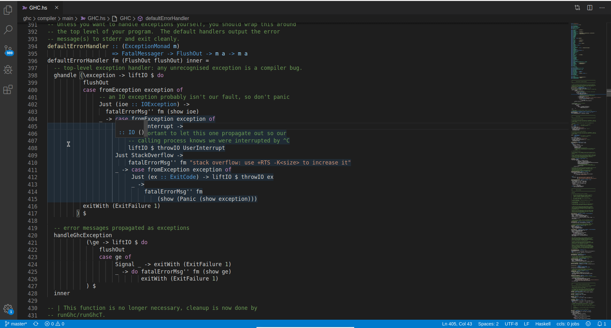
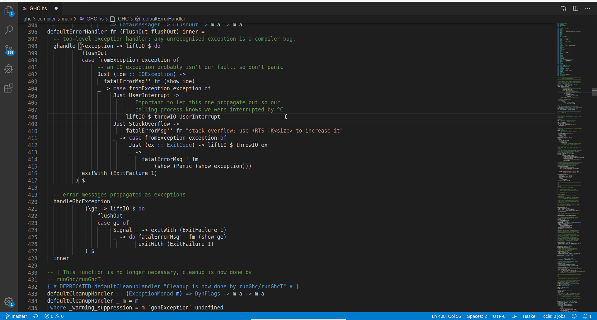
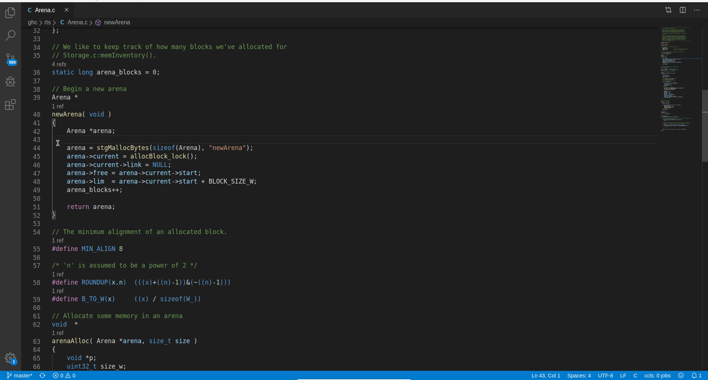
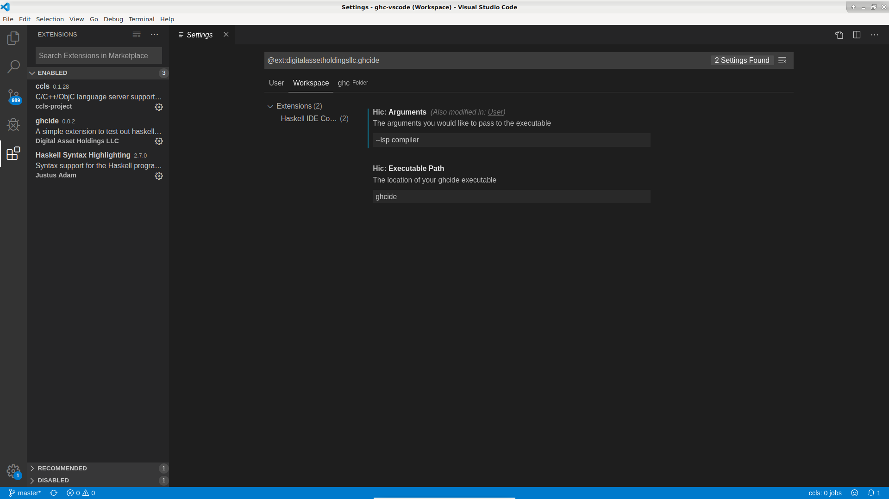

This page describes how to easily setup [Visual Studio Code](https://code.visualstudio.com/) (VSCode) for GHC development. This includes [Language Server Protocol](https://microsoft.github.io/language-server-protocol/) (LSP) support for Haskell and C files. The former is accomplished by using [`ghcide`](https://github.com/digital-asset/ghcide), the latter by [`ccls`](https://github.com/MaskRay/ccls).

The whole procedure is very similar to that described for [Spacemacs](spacemacs). If you miss somethings here, it might be on that other page. However, this page should be self-contained (with some links to other pages to reduce duplication in the wiki).

Some animations to demonstrate what you can expect:



 




# Plan

[[_TOC_]]

# Install [`ghc.nix`](https://github.com/alpmestan/ghc.nix)

If you haven't already installed `ghc.nix`, please refer to the corresponding section on the [Spacemacs](spacemacs#ghcnix) page.

## Configure [`ghc.nix`](https://github.com/alpmestan/ghc.nix) with a `shell.nix` file

Create a `shell.nix` file your ghc source folder, that looks like this:

```nix
import ./ghc.nix/default.nix {
  bootghc = "ghc865";
  withIde = true;
  withHadrianDeps = true;
  cores = 8;
  withDocs = false;
}
```

For the context of this page, only the argument `withIde = true;` matters. It makes sure that the resulting Nix environments contain the right `ghcide` executable.

## Build GHC with `ghc.nix`

Some source code files are generated during build.

Build GHC in the context defined by `ghc.nix` and `shell.nix`, e.g.
```bash
nix-shell --command 'hadrian/build.sh -c -j12 --docs=none --flavour=Devel2'
```

**N.B.**: Probably we do not need a full build to use the IDE tooling, because source files are generated pretty early. However, you likely - sooner or later - want to have a fully built GHC: To run tests, do manual testing, etc..

## Create `compile_commands.json` (C IDE support)

`ccls` needs a [`compile_commands.json`](https://clang.llvm.org/docs/JSONCompilationDatabase.html) (*JSON Compilcation Database*) file as configuration. This file is mostly a mapping of `*.c` filenames to C compiler arguments.

`compile_commands.json` is generated by [`bear`](https://github.com/rizsotto/Bear), a tool that intercepts all calls to the C compiler.

```
nix-shell -p bear --command 'bear hadrian/build.sh -j12 --freeze1 --flavour=Devel2 stage2:lib:rts'
```

**N.B.**: I think the command in this section can be optimized.

# Start and configure VSCode
## Start VSCode in a ghc.nix/nix-shell environment

```bash
nix-shell -p vscode ccls
```

## Install `ghcide` and `ccls` plugins
Install the `ghcide` plugin in VSCode. It's listed as an extension in the VSCode Market Place: https://marketplace.visualstudio.com/items?itemName=DigitalAssetHoldingsLLC.ghcide

Some goes for the `ccls` plugin: https://marketplace.visualstudio.com/items?itemName=ccls-project.ccls

## Create workspaces

Create two distinct workspaces for the GHC compiler and Hadrian.

The simplest way is to:
- `File -> New Window`
- `File -> Open Folder...` (in the new window)
- `File -> Save Workspace As...` (in the new window)

The folder of your GHC compiler workspace is the source root of the cloned GHC repository. The Hadrian folder, is `hadrian/` in that previously described folder.

So, e.g. if your GHC source folder has the path `/home/sven/src/ghc`, then the two folders are:
- **`/home/sven/src/ghc`** for GHC
- **`/home/sven/src/ghc/hadrian`** for Hadrian

## Plugin configuration

### `ccls`

Works out of the box! It automatically finds the `compile_commands.json` file and uses it as configuration.

### `ghcide`

The are the arguments to the `ghcide` plugin: `Hic: Arguments` (`hic.arguments`) and `Hic: Executable Path` (`hic.executablePath`).
You have to set them per workspace, i.e. `hic.arguments` differs for the GHC compiler and the Hadrian workspace.

| Workspace    | `hic.arguments`  | `hic.executablePath` |
|--------------|------------------|----------------------|
| GHC Compiler | `--lsp compiler` | `ghcide`             |
| Hadrian      | `--lsp .`        | `ghcide`             |

