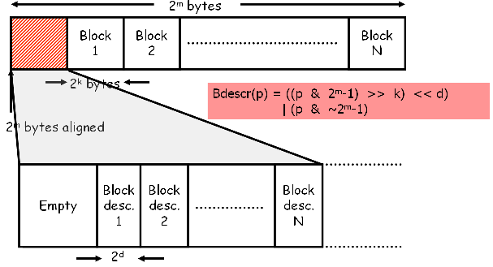

# The Block Allocator


Source: [includes/rts/storage/Block.h](https://gitlab.haskell.org/ghc/ghc/tree/master/ghc/includes/rts/storage/Block.h), [rts/sm/BlockAlloc.h](/trac/ghc/browser/ghc/rts/sm/BlockAlloc.h), [rts/sm/BlockAlloc.c](/trac/ghc/browser/ghc/rts/sm/BlockAlloc.c), [includes/rts/storage/MBlock.h](/trac/ghc/browser/ghc/includes/rts/storage/MBlock.h), [rts/sm/MBlock.c](/trac/ghc/browser/ghc/rts/sm/MBlock.c).


The block allocator is where the storage manager derives much of its flexibilty.  Rather than keep our heap in a single contiguous region of memory, or one contiguous region per generation, we manage linked lists of memory blocks.  Managing contiguous regions is difficult, especially when you want to change the size of some of the areas.  A block-structured storage arrangement has several advantages:

- resizing areas of memory is easy: just chain more blocks onto the list.

- managing large objects without copying is easy: allocate each one a complete block, and use the block linkage to
  chain them together.

- free memory can be recycled faster, because a block is a block.


The concept relies on the property that most data objects are significantly smaller than a block, and only rarely do we need to allocate objects that approach or exceed the size of a block.

## Structure of blocks


We want to allocate memory in units of a small block (around 4k, say).  Furthermore, we want each block to have an associated small structure called a *block descriptor*, which contains information about the block: its link field, which generation it belongs to, and so on.  This is similar to the well-known "BiBOP" (Big Bag of Pages) technique, where objects with similar tags are collected together on a page so as to avoid needing to store an individual tag with each object.


We want a function `Bdescr(p)`, that, given an arbitrary pointer into a block, returns the address of the block descriptor that corresponds to the block containing that pointer.


There are two options:

- Put the block descriptor at the start of the block.  `Bdescr(p) = p & ~BLOCK_SIZE`.  This option has problems if
  we need to allocate a contiguous region larger than a single block (GHC does this occasionally when allocating
  a large number of objects in one go).

- Allocate memory in larger units (a *megablock*), divide the megablock into blocks, and put all the block
  descriptors at the beginning.  The megablock is aligned, so that the address of the block descriptor for
  a block is a simple function of its address.  The 'Bdescr' function is more complicated than the first
  method, but it is easier to allocate contiguous regions (unless the contiguous region is larger than
  a megablock...).


We adopt the second approach.  The following diagram shows a megablock:




We currently have megablocks of 1Mb in size (m = 20) with blocks of 4k in size (k = 12), and these sizes are easy to change  ([includes/rts/Constants.h](https://gitlab.haskell.org/ghc/ghc/tree/master/ghc/includes/rts/Constants.h)).  


Block descriptors are currently 32 or 64 bytes depending on the word size (d = 5 or 6).  The block descriptor itself is 
the structure `bdescr` defined in [includes/rts/storage/Block.h](https://gitlab.haskell.org/ghc/ghc/tree/master/ghc/includes/rts/storage/Block.h), and that file also defines the `Bdescr()` macro.


The block allocator has a the following structure:

- At the bottom, talking to the OS, is the megablock allocator ([rts/sm/MBlock.c](https://gitlab.haskell.org/ghc/ghc/tree/master/ghc/rts/sm/MBlock.c), [includes/rts/storage/MBlock.h](/trac/ghc/browser/ghc/includes/rts/storage/MBlock.h)).
  It is responsible for delivering megablocks, correctly aligned, to the upper layers.  It is also responsible for
  implementing [HEAP_ALLOCED()](commentary/heap-alloced): the predicate that tests whether a pointer points to dynamically allocated memory
  or not.  This is implemented as a simple bitmap lookup on a 32-bit machine, and something more complex on
  64-bit addressed machines.  See [includes/rts/storage/MBlock.h](https://gitlab.haskell.org/ghc/ghc/tree/master/ghc/includes/rts/storage/MBlock.h) for details.

  Currently, megablocks are never freed back to the OS, except at the end of the program.  This is a potential
  improvement that could be made.

- Sitting on top of the megablock allocator is the block layer ([includes/rts/storage/Block.h](https://gitlab.haskell.org/ghc/ghc/tree/master/ghc/includes/rts/storage/Block.h), [rts/sm/BlockAlloc.c](/trac/ghc/browser/ghc/rts/sm/BlockAlloc.c)).
  This layer is responsible for providing:

  ```wiki
     void *allocGroup(int)
     void freeGroup(void *)
  ```

  These functions allocate and deallocate a block *group*: a contiguous sequence of blocks (the degenerate, and common, case
  is a single block).  The block allocator is responsible for keeping track of free blocks.  Currently it does this by
  maintaining an ordered (by address) list of free blocks, with contiguous blocks coallesced.  However this is certanly
  not optimal, and has been shown to be a bottleneck in certain cases - improving this allocation scheme would be good.
