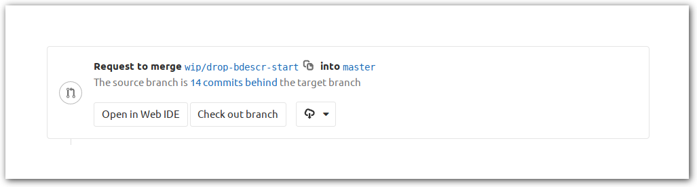
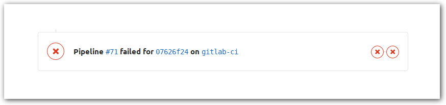
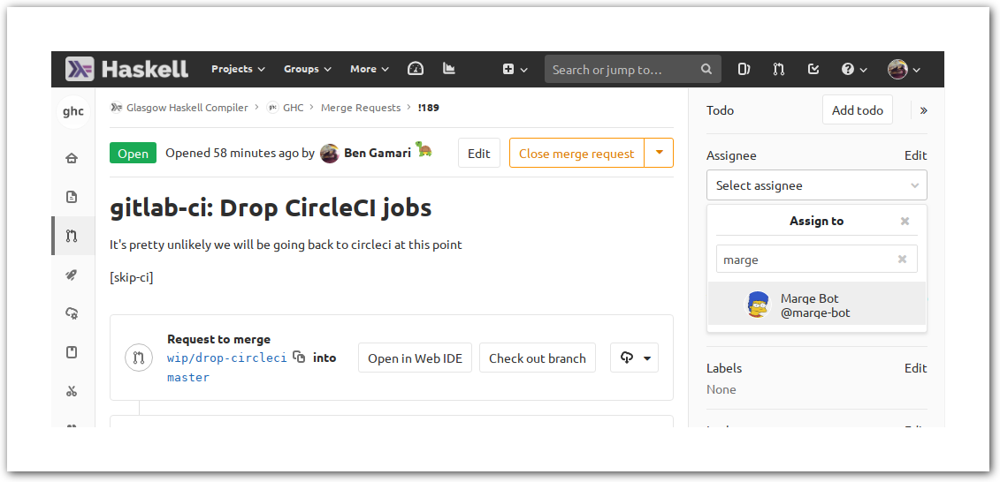

This is GHC's GitLab instance. GitLab has replaced Trac and Phabricator as the center of GHC's development community. You may wish to see the [table of contents](./index) to get a sense for what is available in this Wiki.

<!--
To generate images with borders:
```
mkdir -p shadow
rm shadow/*
for i in *.png; do 
        nix run nixpkgs.imagemagick -c \
                convert $i -bordercolor white -border 50 \
                \( +clone -background black -shadow 80x5+2+2 \) \
                +swap -background white -layers merge +repage \
                shadow/$i
done
```
-->

# Logging in

If you had a Trac account then you likely already have a GitLab account as a result of the Trac import. This account will have a username of the form `trac-$TRAC_USERNAME`. Contact @bgamari with your email address to have a password reset email sent. Once you have gained access to this account you may change your username to remove the `trac-` prefix

If you do not have a Trac account (or would prefer to start from scratch with a new account) you can [log in](https://gitlab.haskell.org/users/auth/github) using your GitHub account or [create](https://gitlab.haskell.org/users/sign_in) a new GitLab account.

# Merge requests

Submitting a patch for incorporation into the tree is done by creating a *merge request*. The merge request serves as a place to conduct code review, collect continuous integration results, and eventually merge your patch.

## Opening a merge request

To open a merge request:

1. Push your branch. You may push either to your fork or the primary `ghc/ghc` project.
2. Starting from the [GHC GitLab project](https://gitlab.haskell.org/ghc/ghc) click on the *Merge Requests* link in the left navigational bar.
3. Click on the green *New Merge Request* button on the top right corner of the Merge Requests page
4. In the left drop-down of the *Source branch* pane select the project to which you pushed your branch.
5. In the right drop-down of the *Source branch* pane select the name of your branch.
6. Click on the green *Compare branches and continue* button.
7. Give your merge request a title
8. Write a description of your change. This should be ideally at very least a few sentences to help reviewers understand what you have done.
9. Click on the green *Submit merge request* button.

## Working with your merge request

Your merge request shows you several panes information:

Top-most is the request's title and description. These can be edited by pressing the yellow `Edit` button on the top-right corner of the page.

The next pane summarises your merge request, showing the the source and target branches.



The next pane shows the status of the merge request's continuous integration builds. If the build has failed you can click on the red *X* icon to see the build log.



At the bottom of the page is the code review interface, consisting of several tabs:


The *Discussion* tab shows a summary of the comments left on the change. This includes comments left in-line in the code, as well as those independent of the code. 

The *Commits* tab lists the commits being proposed for merge. These may be clicked upon to restrict the diff to only changes made by that commit. 

The *Pipelines* tab provides a more detailed overview on the state of the various continuous integration jobs associated with the merge request.

Finally, the *Changes* tab shows the patch itself. This view may be restricted to changes made by a single commit by selecting the commit in the *Commits* tab. Moreover, one may view previous iterations of the merge request using the two drop-down menus at the top of the tab. To leave an inline comment click on a line in the patch.

## Merging your merge request

Currently we merge MRs with the aid of @marge-bot. Marge is a robot who will look after your patch, ensuring it remains up-to-date with `master` while being a candidate for merge.

After your MR has been reviewed and approved by a GHC developer you can flag your it for merge by assigning it to @marge-bot using the "Assignee" field in the right sidebar:



# Tickets

## Migration from Trac

Most of the tickets here were carried over from GHC's previous Trac installation. See the [wiki](tickets-from-trac) for details about this migration.