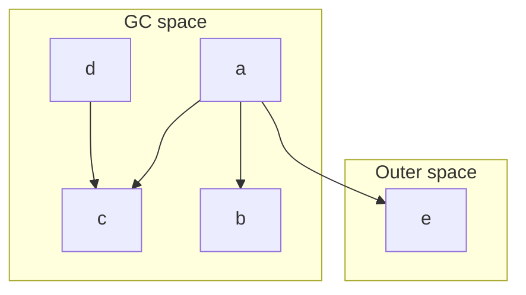
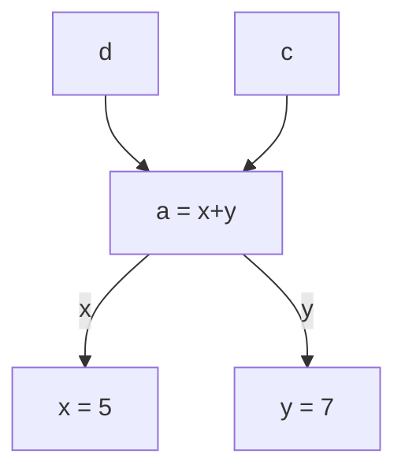
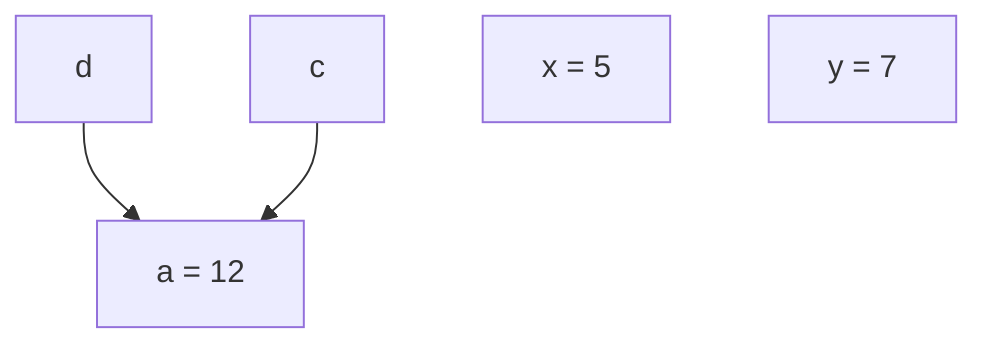
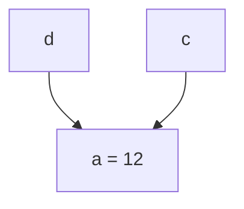

# Closures, GC space, outer space

Closures live in the GC space. They form a graph:
* nodes are closures
* edges are references from a closure to another

Closures can also reference pinned data in outer space with usual pointers. These pointer are not managed by the GC.

The graph is **mutable**:
* some nodes are **removed** (collected) when they are not needed anymore
* some nodes are **evaluated**/reduced

after evaluation of `a`, it becomes

Note that sharing is preserved: if `a` has been evaluated to evaluate `c`, it won't have to be evaluated again to evaluate `d`.

The garbage collector will detect that `x` and `y` are not used anymore and free them:

# Observable graph reduction

Graph reduction is done behind the scene by the runtime system. Most of the time, Haskell programmers don't have to worry about it. Nevertheless we sometimes want to get some control on graph reduction to optimize some programs or to produce faster code.

GHC provides several mechanisms for this:
1. finalizers: callbacks executed when a closure is collected
2. `seq# a b`: control evaluation order: this expression evaluates to `b` but it evaluates `a` before returning `b`.
3. `keepAlive# a f`: closure `a` is kept-alive (not collected) while `f` hasn't been evaluated