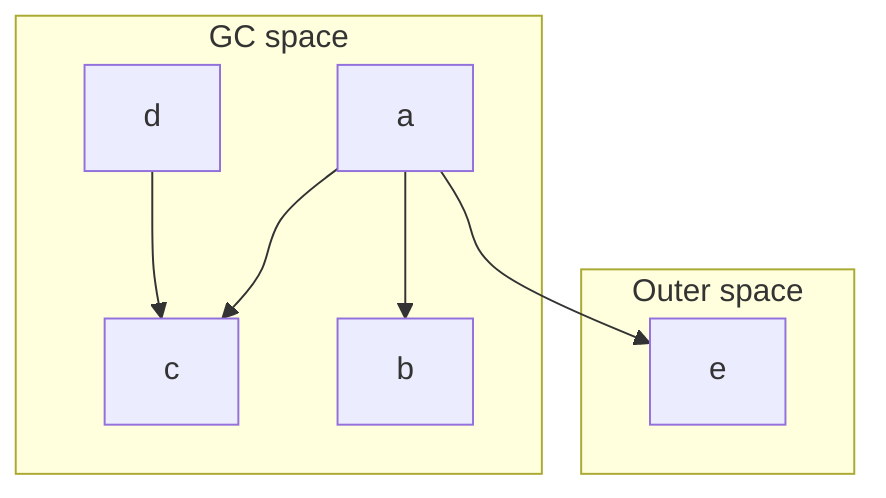
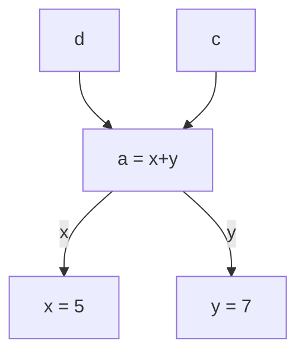
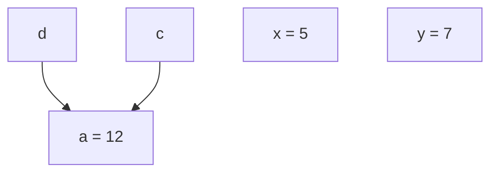
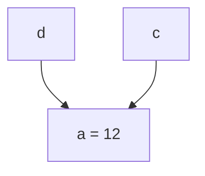

# Closures, GC space, outer space

Closures live in the GC space. They form a graph:
* nodes are closures
* edges are references from a closure to another

Closures can also reference pinned data in outer space with usual pointers. These pointer are not managed by the GC.



The graph is **mutable**:
* some nodes are **removed** (collected) when they are not needed anymore
* some nodes are **evaluated**/reduced



after evaluation of `a`, it becomes



Note that sharing is preserved: if `a` has been evaluated to evaluate `c`, it won't have to be evaluated again to evaluate `d`.

The garbage collector will detect that `x` and `y` are not used anymore and free them:



# Observable graph reduction

Graph reduction is done behind the scene by the runtime system. Most of the time Haskell programmers don't have to worry about it. Nevertheless they sometimes want to get some control on graph reduction to optimize memory usage and performance or to interact with external resources.

GHC provides several mechanisms for this:
1. finalizers: callbacks executed when a closure is collected
2. `seq# a b`: control evaluation order: this expression evaluates to `b` but it evaluates `a` before returning `b`.
3. `keepAlive# a f`: closure `a` is kept-alive (not collected) while `f` hasn't been evaluated

Examples:

* Release a foreign resources (memory, file descriptor...) when it isn't used anymore:

```haskell
let x = ForeignPtr p
addFinalizer x (free p) 
-- ... use x
```

* Evalute a big expression to a small result before storing it in a structure to avoid memory leak

```haskell
do
  big <- read BIGARRAY
  let r = indexArray 10 big
  return (r `seq` MyValue r)
  -- we don't want to keep `big` alive because of the thunk of `r`
  -- which evaluates to a small value and is cheap to compute, hence we
  -- force the evaluation of `r` before storing it in `MyValue` "box"
```

* Keep a memory region alive

```haskell
do
  addr <- mallocBytes 1000 -- return an Addr#
  -- we can't add a finalizer to `addr`: it's not a closure but a usual pointer (a number)
  -- so we add it to a `Ptr` closure boxing it:
  let p = Ptr addr
  addFinalizer p (free addr)
  -- now we want to use `addr` directly (for performance reason)
  -- but we must also keep the box `p` alive so that the finalizer isn't run!
  keepAlive# p (performWorkWith addr)
```

Note: this mechanism is also used for GHC managed `ByteArrays#`. When the `ByteArray#` is pinned we can get its memory address and use it like an external memory region: pass it to FFI functions, use efficient pointer operations (vector instructions), etc.

# Issues

In Haskell we can declare named closures with bindings (`let`/`where` clauses or top-level bindings). But Haskell programs are transformed *a lot* during compilation and currently we have no guaranty that the transformed code behave as we expect at runtime. Let's see some example of wrong transformations:

## Inlining

Inlining consists in replacing a binder occurrence (i.e. a variable) by a binder unfolding (i.e. the expression associated to the binder). The risk is to duplicate work because we lose sharing. But by doing this we may simplify/optimize the code at the occurrence site and maybe avoid the creation of the closure at all.

1. Inlining + `seq#` (#2273)

In the following code, the intent is to evaluate `chp` before evaluating `f chp` (which can be any expression using `chp`):

```haskell
let chp = E -- cheap expression
in chp `seq#` f chp
```

If we inline `chp`, we lose this behavior:

```haskell
let chp = E
in E `seq#` f chp
-- BAD: `chp` isn't evaluated before we start evaluating `f chp`

let chp = E
in chp `seq#` f E
-- BAD: `E` isn't evaluated before we start evaluating `f E`.
-- `chp` is but it misses the whole point of the original expression as `chp` isn't used in `f E` anymore
-- (we've lost sharing)

let chp = E
in E `seq#` f E
-- BAD: same as above
```

2. Inlining and `keepAlive#` + finalizers

In the following code, the intent is to keep `p` alive as long as `addr` is used: when `p` is collected, its finalizer frees the memory pointed by `addr`. We can't attach the finalizer to `addr` because it's not a closure.

```haskell
do
  addr <- mallocBytes 1000
  let p = Ptr addr
  addFinalizer p (free addr)
  keepAlive# p $ doSomethingWith addr
```

If we inline `p`, we lose the expected behavior:

```haskell
do
  addr <- mallocBytes 1000
  let p = Ptr addr
  addFinalizer (Ptr addr) (free addr) -- BAD: finalizer is not added to `p`
  keepAlive# p $ doSomethingWith addr

do
  addr <- mallocBytes 1000
  let p = Ptr addr
  addFinalizer p (free addr)
  keepAlive# (Ptr addr) $ doSomethingWith addr -- BAD: we don't keep `p` alive but another (anonymous) closure
                                               -- p`s finalizer may free the memory pointed by `addr` too soon and segfault ensues
```