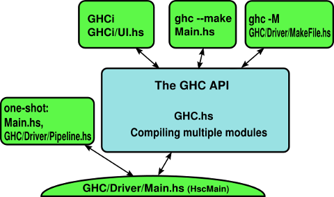

# GHC Commentary: Top-level orgainsation of GHC

The GHC API is the interface exported by [compiler/main/GHC.hs](https://gitlab.haskell.org/ghc/ghc/blob/master/compiler/main/GHC.hs).  To compile a Haskell module that uses the GHC API, use the flag `-package ghc` (in GHC 6.6 and later).  GHC itself contains a few front-ends:

- The "one-shot" mode, where GHC compiles each file on the command line separately (eg. `ghc -c Foo.hs`).  This mode
  is implemented directly on top of [HscMain](commentary/compiler/hsc-main), since it compiles only one file at a
  time.  In fact, this is all that GHC consisted of prior to version 5.00 when GHCi and `--make` were introduced.

- GHCi, the interactive environment, is implemented in [ghc/GHCi/UI.hs](https://gitlab.haskell.org/ghc/ghc/blob/master/ghc/GHCi/UI.hs) and sits squarely on top
  of the GHC API.

- `--make` is almost a trivial client of the GHC API, and is implemented in [ghc/Main.hs](https://gitlab.haskell.org/ghc/ghc/blob/master/ghc/Main.hs).

- `-M`, the Makefile dependency generator, is also a client of the GHC API and is implemented in 
  [compiler/main/DriverMkDepend.hs](https://gitlab.haskell.org/ghc/ghc/blob/master/compiler/main/DriverMkDepend.hs).

Note that since GHC is packaged as a single binary, all of these front-ends are present, and there is a single command-line interface implemented in [ghc/Main.hs](https://gitlab.haskell.org/ghc/ghc/blob/master/ghc/Main.hs).

