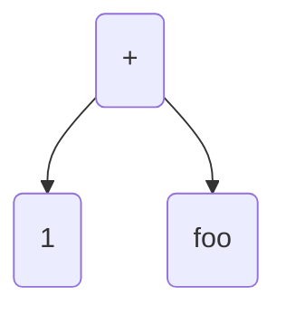
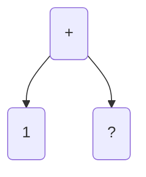

This page describes the challenges of implementing a new representation form for typed template haskell quotations. 

The main idea of the implementation is

> The representation of Haskell expressions is `CoreExpr`s. 

The motivation for this is to solve bugs like #15437 #15833
#15863 and #15865. Their cause can all be traced to the way
that quoted expressions are represented as renamed syntax
trees. 

# Template Haskell Recap

How does typed template haskell currently work? 

The representation type of expressions is `Q Exp`. 

`Exp` is a representation of renamed askell expressions. When a typed quotation is typechecked, it is verified that it has the correct type before all the type information is discarded. When
a typed quotation is spliced in, it is type checked again to add
back the information that was discarded. For complicated programs
this process fails because as the code is generated, less type information is available than when the quotation was typechecked. It is essential to remember the context a quotation appeared in. 


# Representing terms as core expressions

The idea of representing an expression as a core term is appealing
for a few other reasons than to fix the aforementioned bugs.

1. There is already a built in way to serialize core expressions
because we write core expressions to interface files. 

2. It avoids redundant work renaming and typechecking an expression.

3. It avoids creating massive syntax trees in programs which can take a long time to compile. The representation is completely opaque so the optimizer does not inspect or manipulate it in any way. 

# Challenges in the implementation

## Deciding the representation

My first attempt at the representation was to define

```
data TExp a = TExp FilePath
```

For example, `foo = [| 1 |] :: TExp Int = TExp "/tmp/foo"` and `/tmp/foo` is a file containing a serialised version of `1`. 

Splicing in `foo` then reads the file, deserialising the expression and directly inserts the core into the program without having to typecheck or rename it.

For simple expressions which do not involve splices this works fine.

## Delaying splices

There is the long standing restriction that top level splices can only refer to identifiers bound in other modules. This is to ensure that the functions are compiled before they need to be evaluated by the splice.

The same restriction does not apply to nested splices but this is because
their evaluation is delayed until the top level splice is run. 

For example,

```
[| 1 + $(foo) |]
```

Creates a syntax tree representing the expression representing `1 + $(foo)` by produce code which is generates a value of type `Q Exp`.



Because the representation constructs a syntax tree which closely mirrors the term it is representing, the spliced term can be inserted naturally so that when the whole representation is evaluated, that branch is filled in by running the splice.

If your representation is a bit more complicated then this approach of embedding the splice into the representation doesn't work. If we think about representing `[| 1 + $(foo) |]` as a core expression now
then there has to be something of type `Int` to fill the hole for the splice. However, `foo` is not of type `Int` but of type `TExpQ Int` so it has to be evaluated before it is placed into the hole.



Evaluating it in place is impossible as there is no guarantee that the function it refers to are compiled yet (if they are defined in the same module). Therefore, there has to be a mechanism to delay running nested splices as before. 

## Delaying Nested Splices

The common solution to this problem is to create an environment of splices and insert placeholders into the expression where to insert the value after it has been evaluated later.  The tricky question is how to represent this environment. 

P1:

This example is quite straightforward to deal with as `foo` is defined globally.

```
foo = [| 1 |]

qux = [| $(foo) |]
```

P2:

This example is much trickier as the splice mentions the variable `x` which is only bound locally.

```
qux x = [| $(x) |]
```

### Solution

The solution is to represent an environment as a pair of `Int`s and `TExpU`. `IfaceExpr` is extended to insert
placeholders for the splice points. The name of the splice point is taken from the unique of the name of the splice point. The environment is then a mapping from these numbers to the expressions which need to be inserted
into each splice point. 

```
data TExpU = TExpU [(Int, TExpU)] String
```

How do brackets end up in this representation? In a similar way to normal quotes. 

```
[| 1 |] = TExpU [] "/tmp/foo"
```

```
[| $(foo) |] = TExpU [(12342, foo)] "/tmp/foo"
```

The key thing to remember is that when `TExpU [(12213,foo)] "/tmp/foo"` is evaluated, then `foo` will evaluate to
something of type `TExpU` which can be inspected and loaded.

When we need to run a splice, the expression is evaluated to something of type `TExpU`. Then

1. The core expression held in the file is loaded into memory as an `IfaceExpr`.
2. The `IfaceExpr` is typechecked with an environment extended by the environment of the bracket.
3. During typechecking, if we find a splice point, the desugarer is reinvoked to load the `TExpU` recursively.

This means that we have to interleave running splices with typechecking an interface file. Thus the desugarer calls `tcIfaceExpr` and `tcIfaceExpr` calls `dsExpr`. This interleaving is necessary to deal with names bound in quotes. 

```
[| \a -> $(foo [| a |]) |] = TExpU [(123, foo (TExpU [] "/tmp/a")] "/tmp/lam"
```

So the core expression which mentions `a` can only be loaded in an environment where `a` is in scope so it has to be delayed being loaded until the interface type checker is inside the lambda of the expression.

### Cross stage persistence

This scheme 


#### Problem with type variables

# What about the Static Pointer Table

# Related Work

* [IR-MetaOCaml : (re)implementing MetaOCaml - Roubinchtein, Evgeny ](https://open.library.ubc.ca/cIRcle/collections/ubctheses/24/items/1.0166800) - Reimplements MetaOCaml to use a native code representation for quotations

